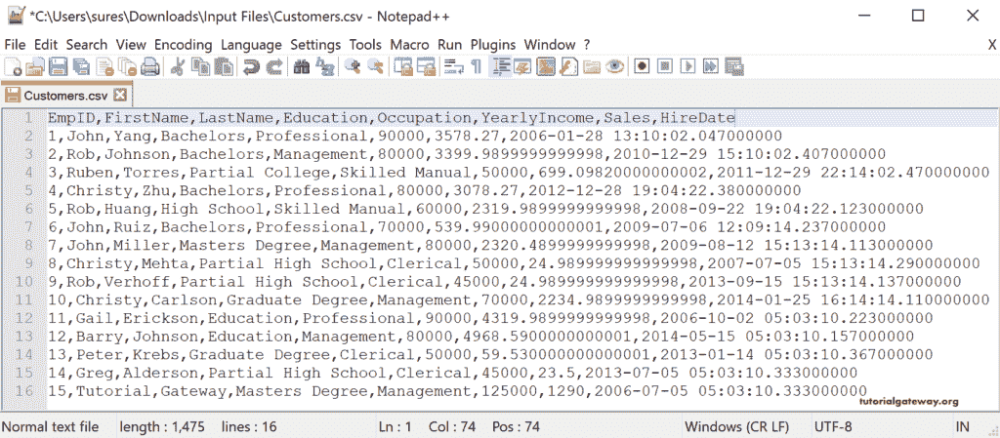
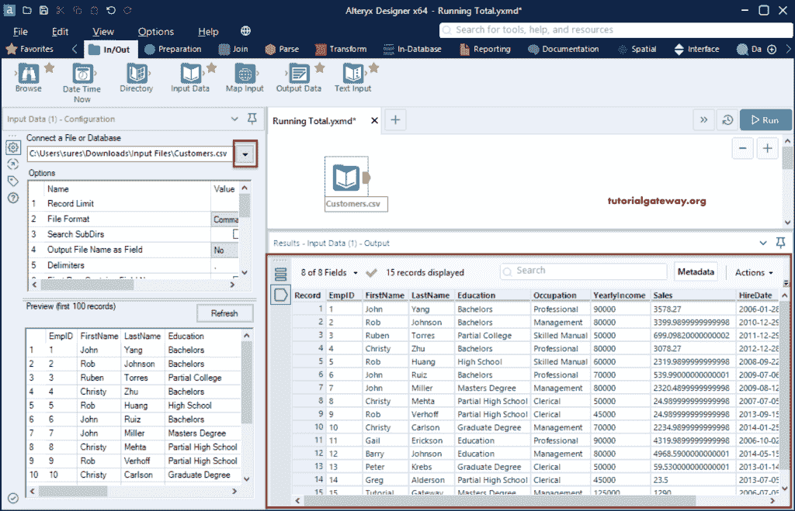
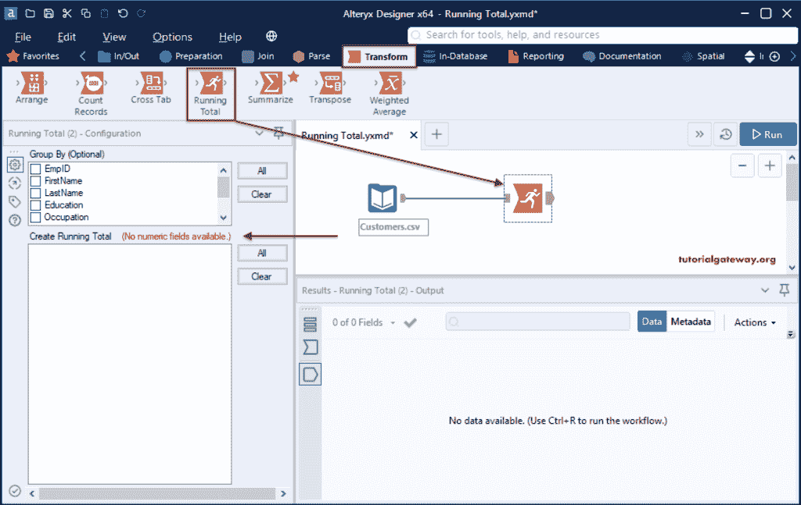
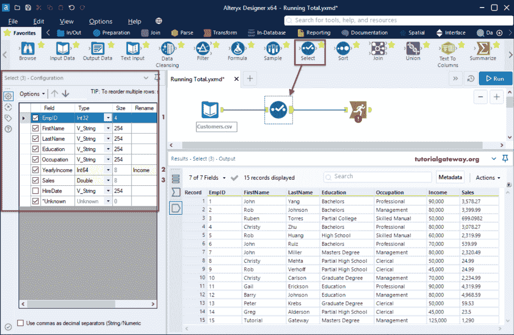
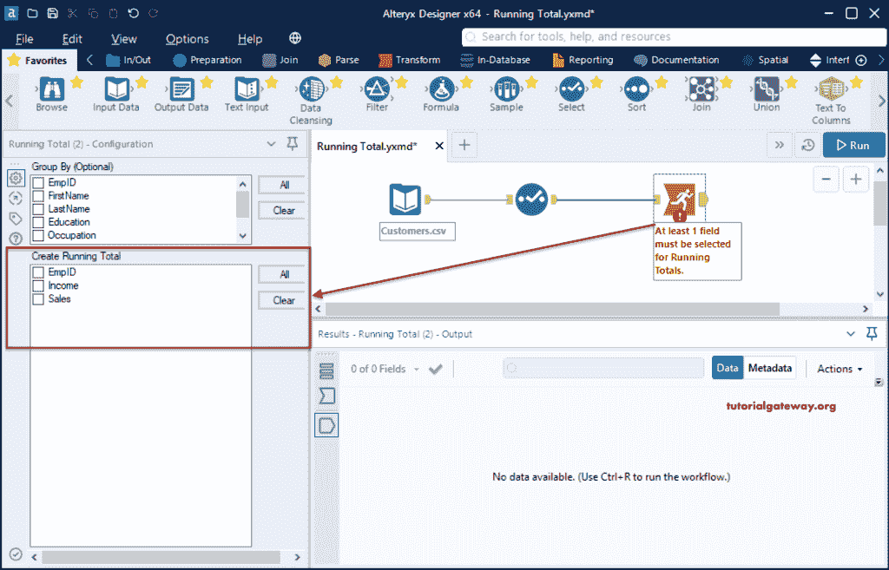
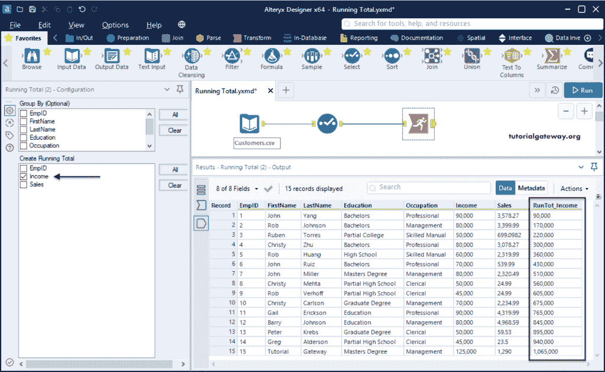
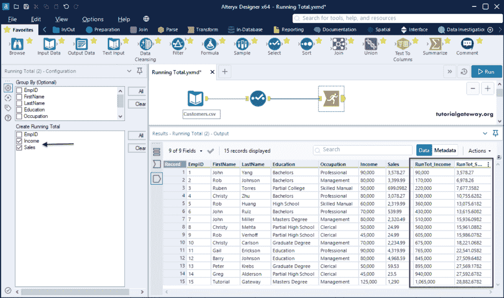
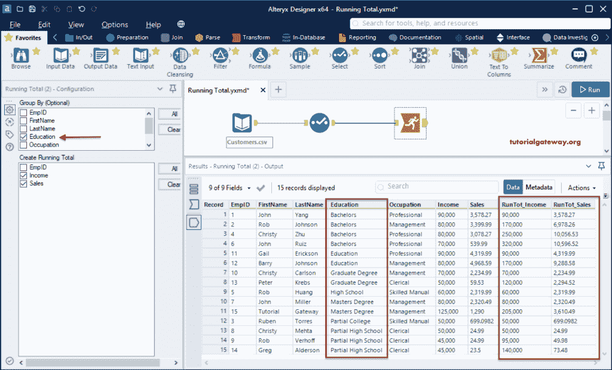
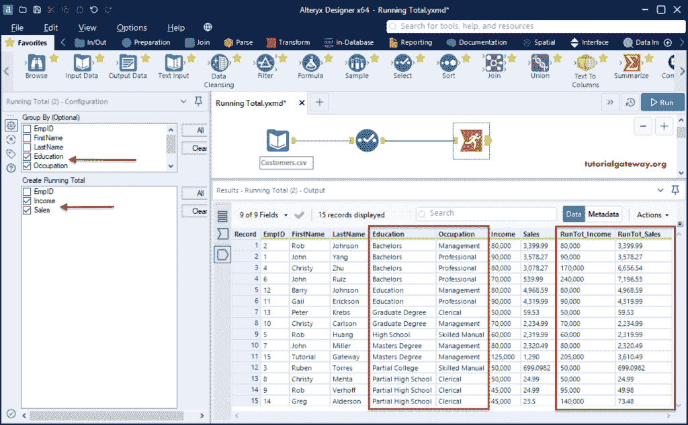

# Alteryx 运行总数

> 原文：<https://www.tutorialgateway.org/alteryx-running-total/>

Alteryx 运行总数工具可帮助您返回或查找给定源的数值列的运行总数。为了演示这个 Alteryx 运行的 total 工具，我们使用了下面的 CSV 文件。

首先，拖放输入数据工具，并从连接文件或数据库选项配置选项卡中选择客户 CSV 文件。

## Alteryx 运行总计示例

请转到转换选项卡，并将运行总计工具拖放到画布上。接下来，将输入连接到此。

如果您观察到“配置”选项卡下的“创建运行总数”部分，它会显示没有可用的数字字段。如前所述，我们需要一个数字列来执行累计。

为了更改列的数据类型，我们在输入和运行总计工具之间添加了选择工具。接下来，我们将 EmpID 更改为 int，年收入更改为 integer 并将其重命名为 Income，销售列更改为 double。

现在，您可以在 Alteryx 的创建运行总数部分看到这三个数字列。

让我计算一下总收入。为此，请勾选收入栏并点击运行按钮。从下面的截图，可以看到结果。

这次我们计算的是销售和收入的累计总额。

我们没有使用分组依据选项，该选项在[Alteryx](https://www.tutorialgateway.org/alteryx-tutorial/)运行总配置选项卡下是可选的。通过使用此选项，我们可以计算每个组的运行总数。让我在教育栏打勾。这意味着它将计算每个教育组的总收入和总销售额。

这一次，我们使用“教育和职业”作为分组依据。它将根据教育和职业对记录进行分组。然后，它会找到该组的运行总数。

