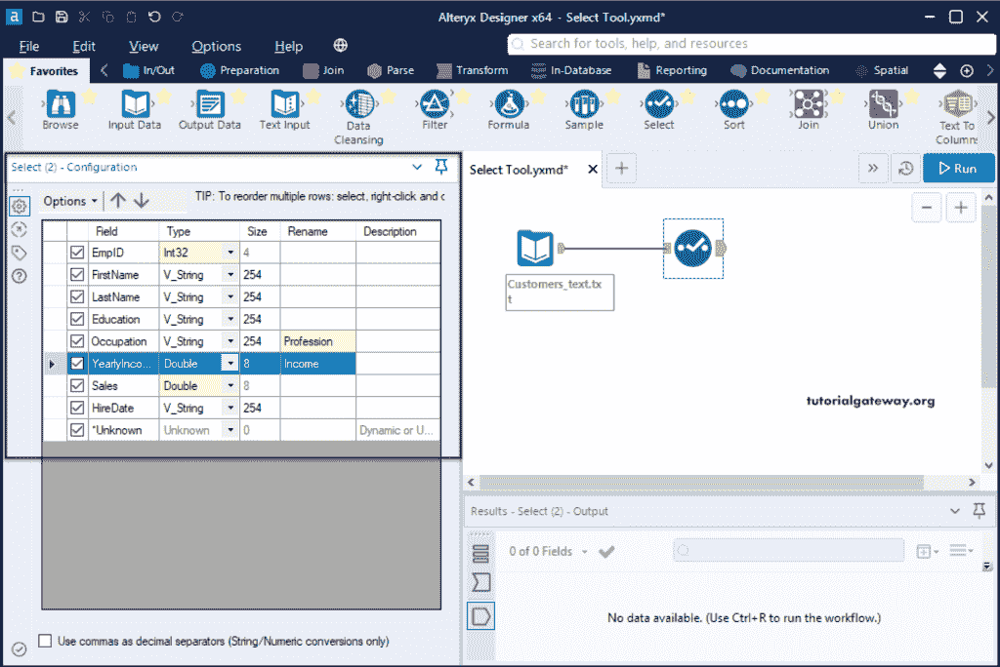
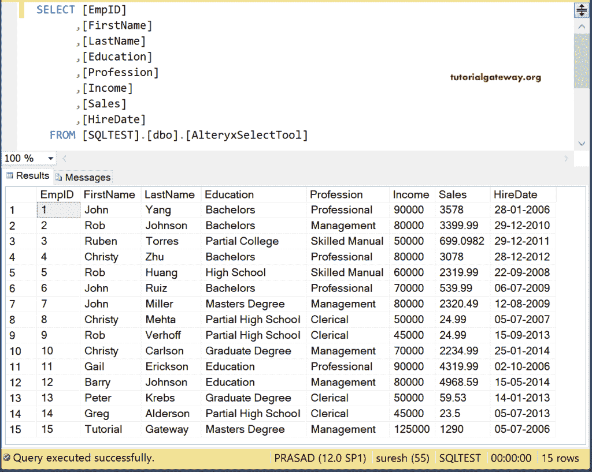

# Alteryx 选择

> 原文：<https://www.tutorialgateway.org/alteryx-select/>

Alteryx Select 工具对检测列很有用，我们可以重命名列的名称。您也可以使用这个 Alteryx 选择工具来更改所需的列数据类型和大小。

拖动输入数据工具，并从配置选项卡中选择客户文本文件。从下图中，您可以看到该文件有十五条记录。

如果查看文本文件元数据，所有列都是字符串数据类型。

## Alteryx 选择工具示例

将选择工具拖放到画布上，并将输入工具连接到其上。

在 Alteryx 选择工具配置选项卡中，您可以看到源列名、数据类型、列大小、用于重命名列的空字段以及提供描述。

通过单击类型旁边的向下箭头，可以显示可用数据类型的列表。请根据您的要求更改 a [Alteryx](https://www.tutorialgateway.org/alteryx-tutorial/) 列的数据类型。

这里，我们将年收入、销售额改为两倍，将 EmpID 改为 32 位整数。然后我们把年收入改名为收入，职业改名为职业。

点击运行按钮查看 Alteryx 选择工具结果。

让我将这个输出加载到 SQL Server 新表 AlteryxSelectTool 中。我们已经解释了将 Alteryx 文本文件加载到 SQL Server 文章中的步骤。

下图显示了 Alteryx [SQL](https://www.tutorialgateway.org/sql/) 的配置设置。

运行选择工具工作流。

在[管理工作室](https://www.tutorialgateway.org/sql-server-management-studio/)内，可以看到 AlteryxSelectTool 表结果。

对于数据类型，您可以查看表定义。

