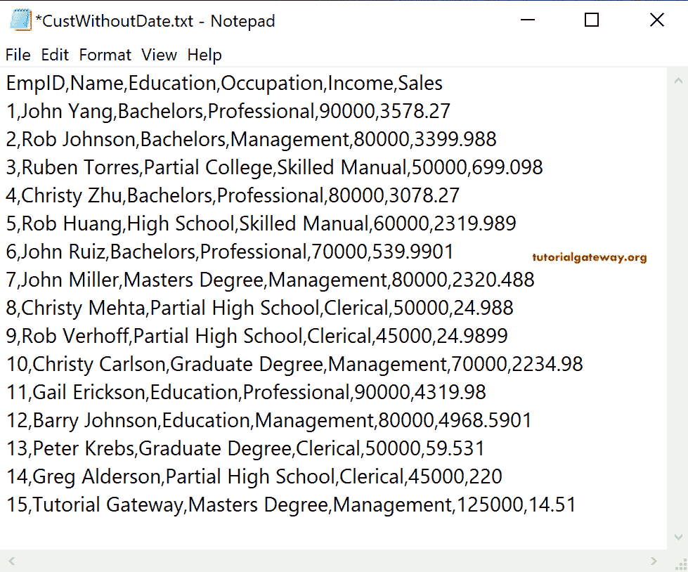
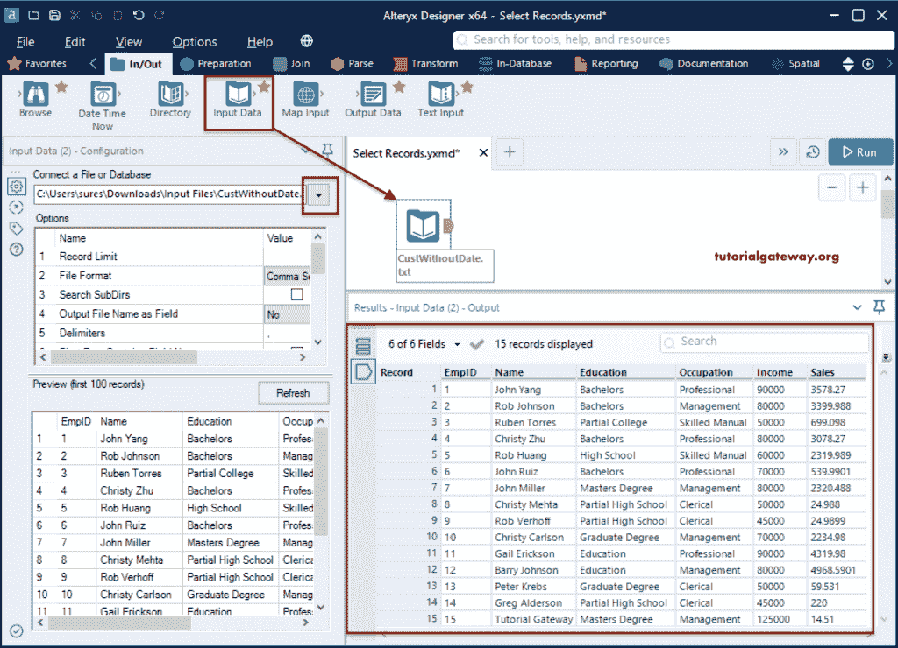
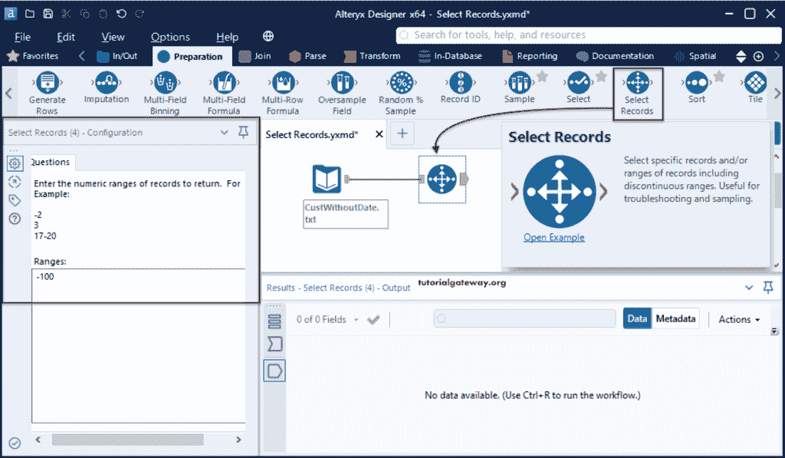
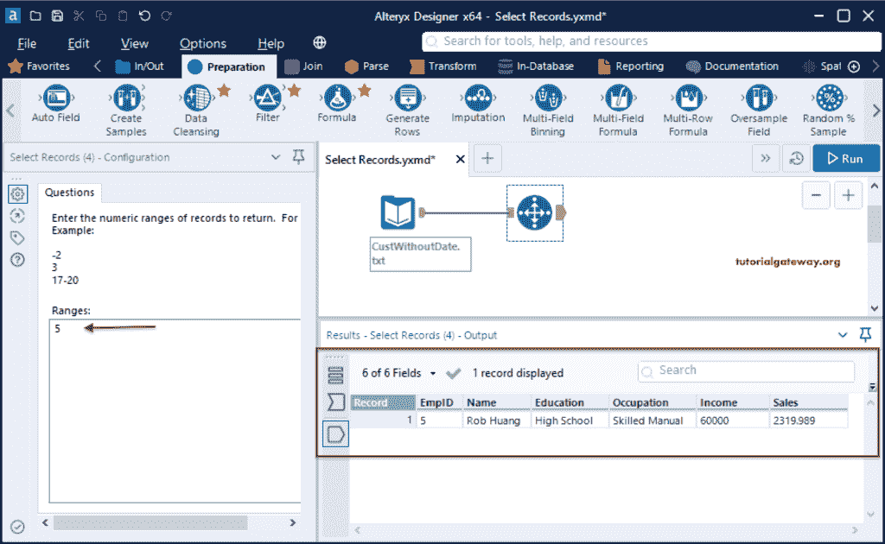
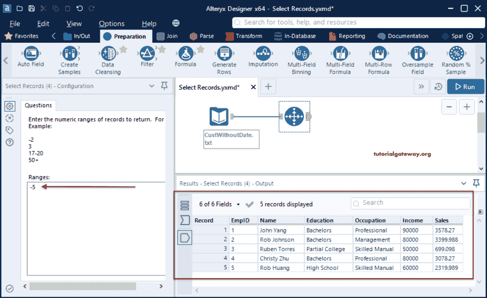
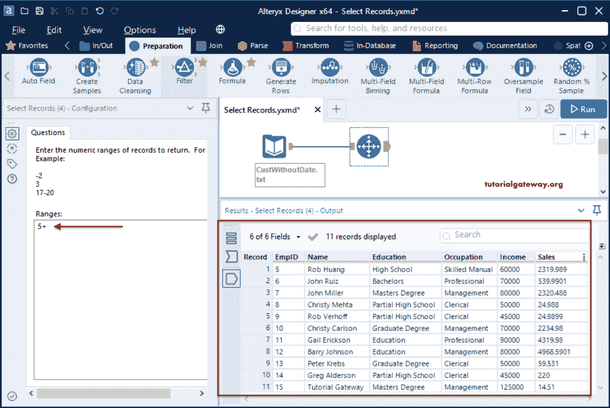
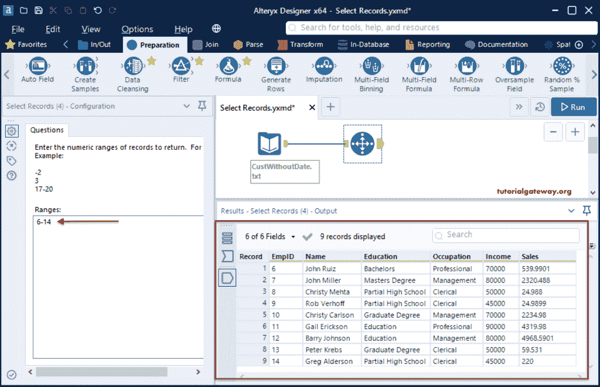
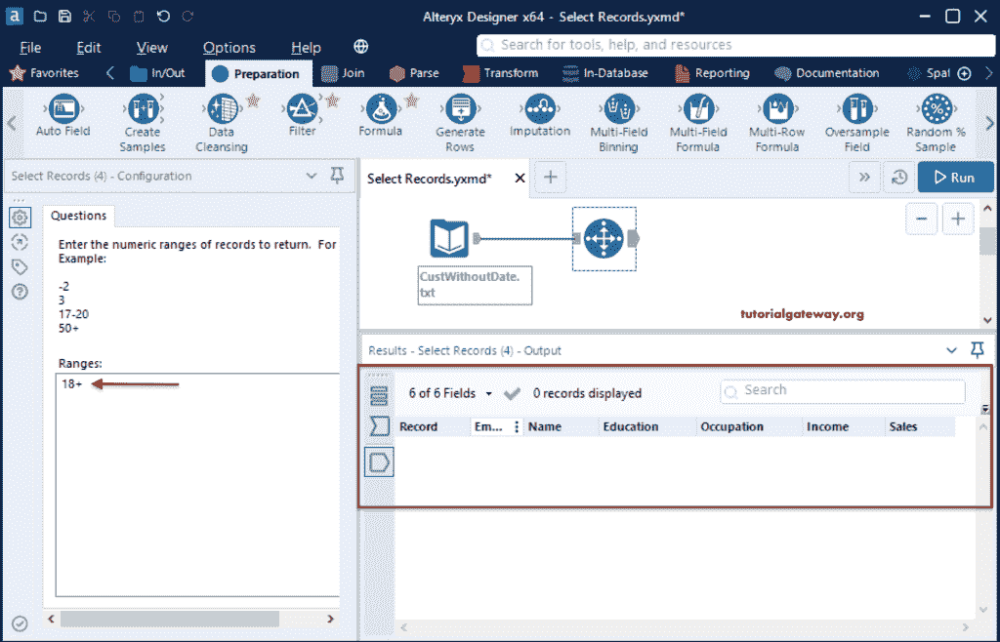

# Alteryx 选择记录

> 原文：<https://www.tutorialgateway.org/alteryx-select-records/>

Alteryx 选择记录工具帮助我们选择一系列行/记录。我们可以使用这个选择记录工具进行行采样，或者返回中断的行范围。为了演示这个 Alteryx 选择记录工具，我们使用了这个文本文件。

放下输入数据工具，并从“连接文件或数据库”选项中选择 CustWithoutDate 文本文件。

## Alteryx 选择记录工具示例

请转到准备选项卡，将选择记录工具拖到画布上，并连接输入工具。如您所见，“选择记录”配置选项卡有一个输入数字范围的选项。根据给定的范围，选择记录工具将显示输出。

我们已经给出了 5 的范围，并点击了运行按钮。如您所见， [Alteryx](https://www.tutorialgateway.org/alteryx-tutorial/) 正在显示客户文件中的第五条记录。

范围= -5。Alteryx 选择记录最多返回 5 个客户。

范围= +5。选择记录工具将客户从 5 返回到最后。

范围= 6-14。选择记录显示从 6 到 14 的客户。

范围= 18。由于没有记录，它不显示记录。

