# Alteryx 排序工具

> 原文：<https://www.tutorialgateway.org/alteryx-sort-tool/>

Alteryx 排序工具可帮助您根据一列或多列按升序和降序对源数据进行排序。为了演示 Alteryx 排序，我们使用了下面的 Customer_Country 文本文件。

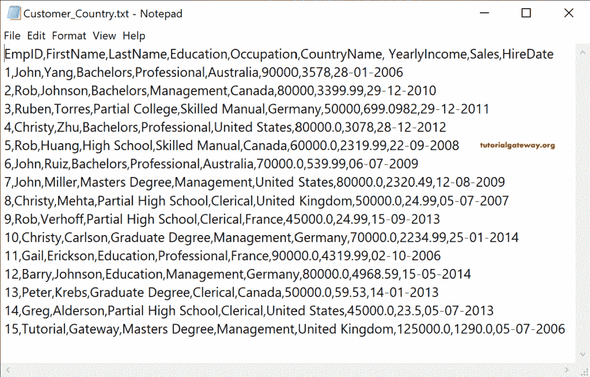

首先，放下输入数据工具，在配置选项卡中，单击向下箭头按钮连接到客户国家文本文件。

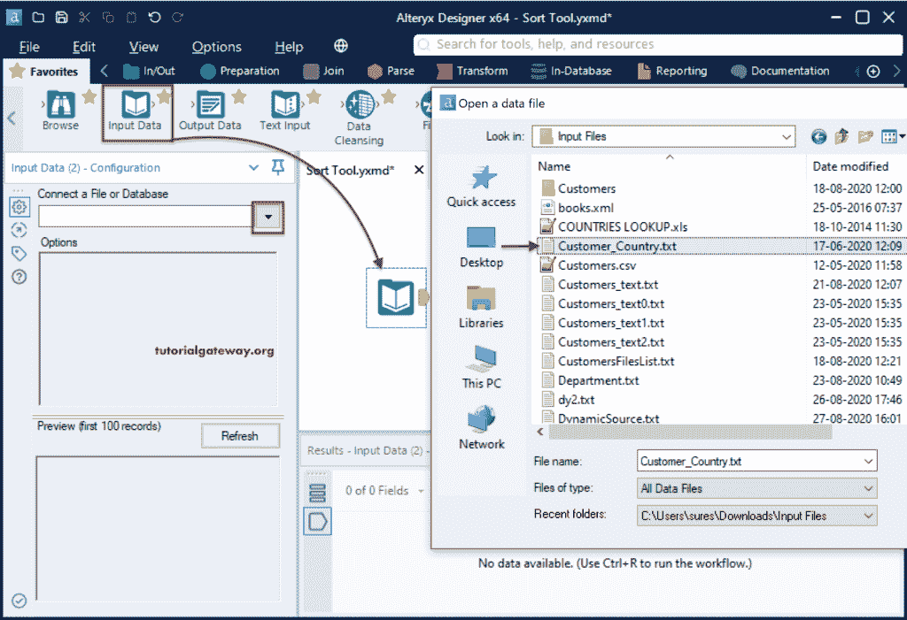

选择文本文件后，将打开以下“解析文件类型”窗口。我们选择了“将其作为分隔文本文件读取”选项，并设置了逗号。

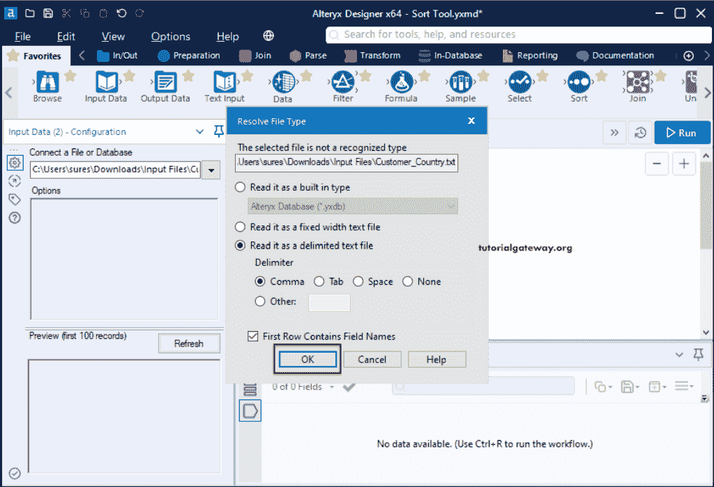

## 交替升序和降序排序

在收藏夹选项卡中，将排序工具拖到画布上，并将输入数据工具输出添加到排序工具中。我们可以在 Alteryx 排序配置选项卡中选择字段或列名以及排序顺序(升序或降序)。

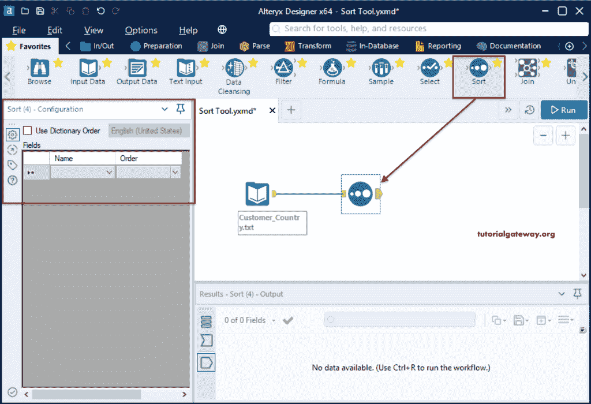

如果单击向下箭头，您可以看到执行排序的可用列列表。

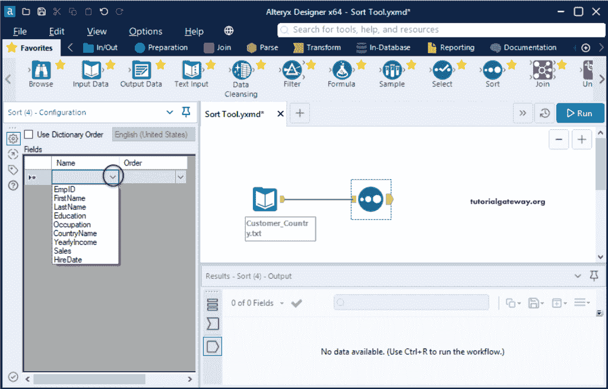

我们选择教育列和排序顺序为升序。这意味着 Alteryx 排序工具必须按教育程度以升序对客户进行排序。

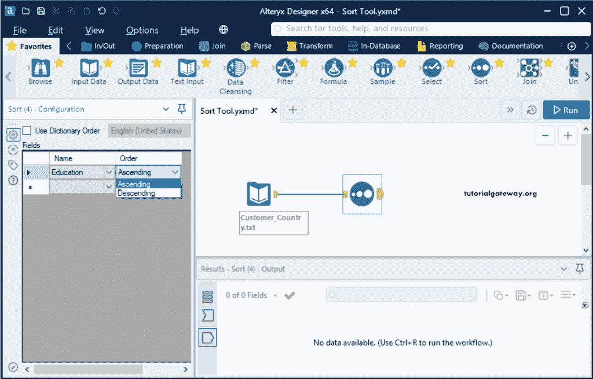

运行并查看排序后的输出。

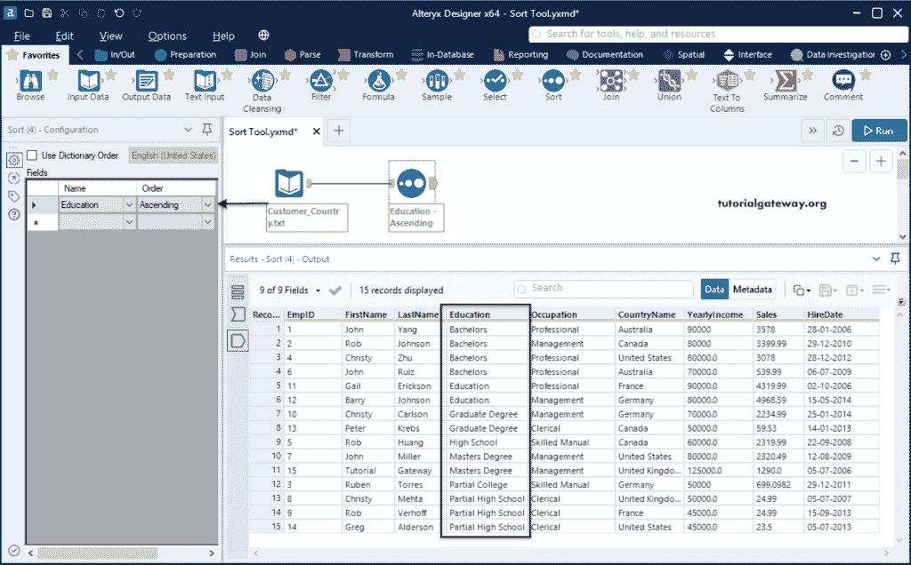

这一次，我们以升序添加了一个职业列。如您所见，客户是按教育程度排序的，然后是职业。

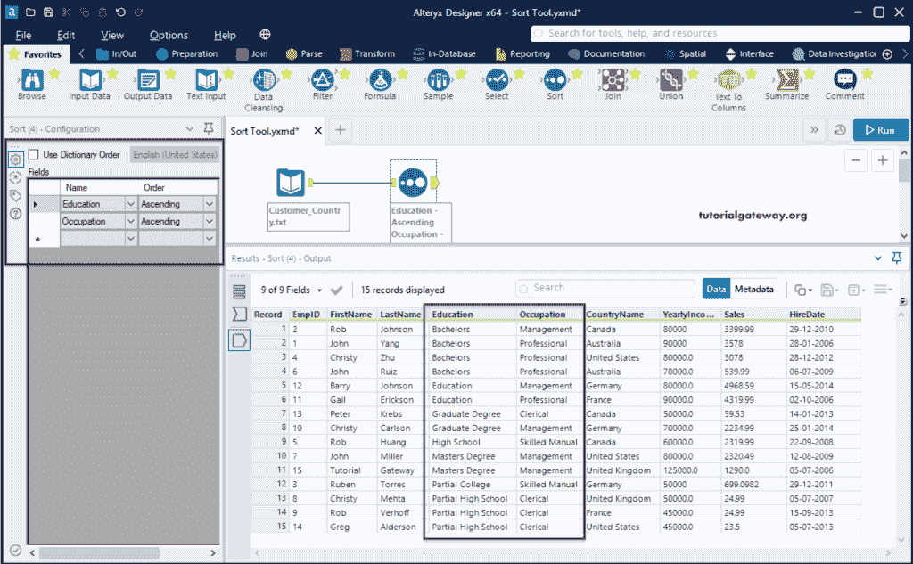

我们也可以使用升序和降序的组合。它按照升序排列客户，按照降序排列国家/地区名称。

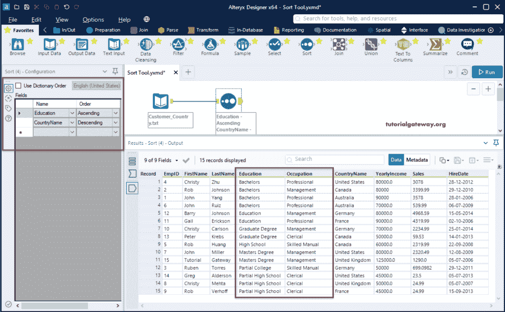

当我们试图按升序对销售列进行排序时，它给出了一个奇怪的结果。这是因为销售列是字符串类型的。

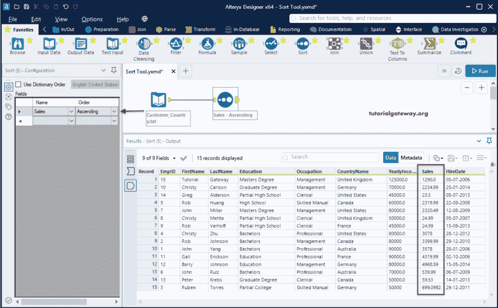

如果要用数值对字符串列进行排序，可以尝试使用 Alteryx 字典顺序选项。它可能给出正确的结果，但不推荐。

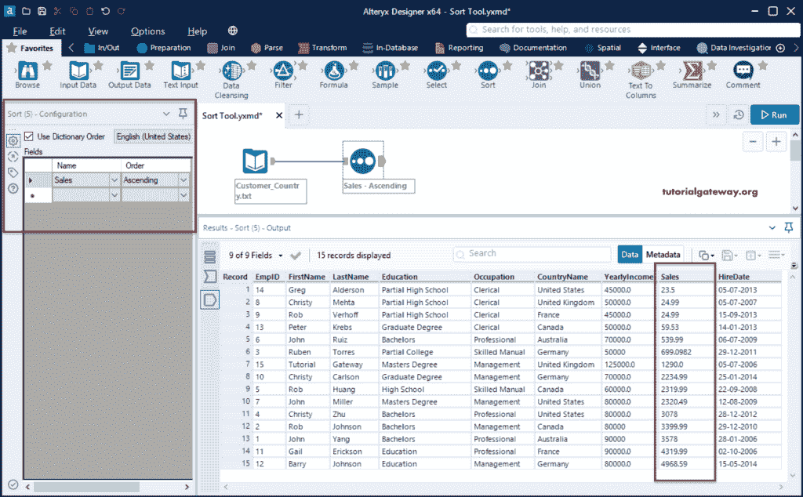

让我给你看看 [Alteryx](https://www.tutorialgateway.org/alteryx-tutorial/) 字典顺序支持的语言列表。

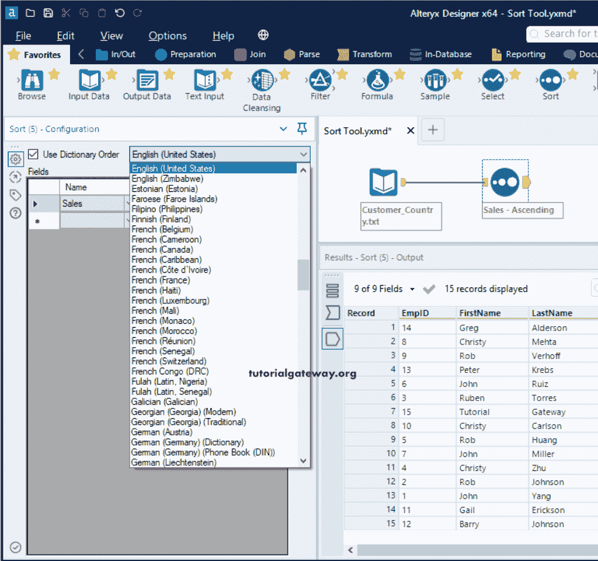

正如我之前所说的，要对数值进行排序，我们必须将列类型更改为数值。我们在“输入”和“排序”工具之间添加了“选择”工具，并将“销售”列改为双精度。

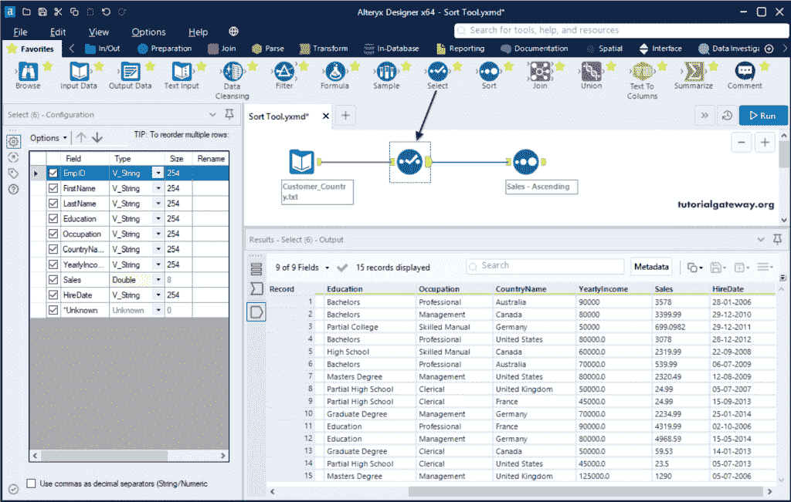

现在，您可以看到按升序排序的销售列。

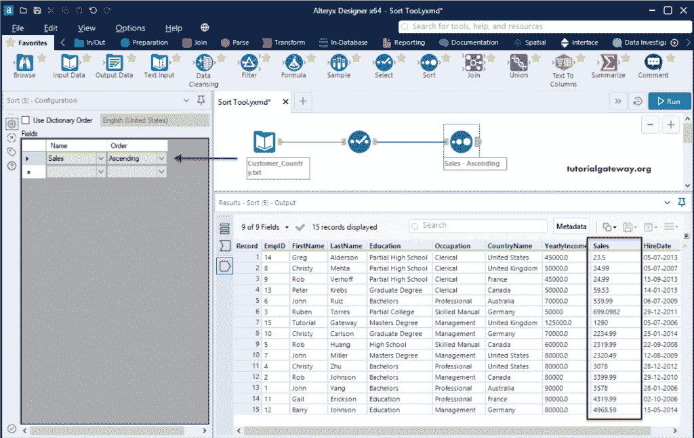

这里，排序工具按国家升序对客户进行排序，按销售额降序对客户进行排序。

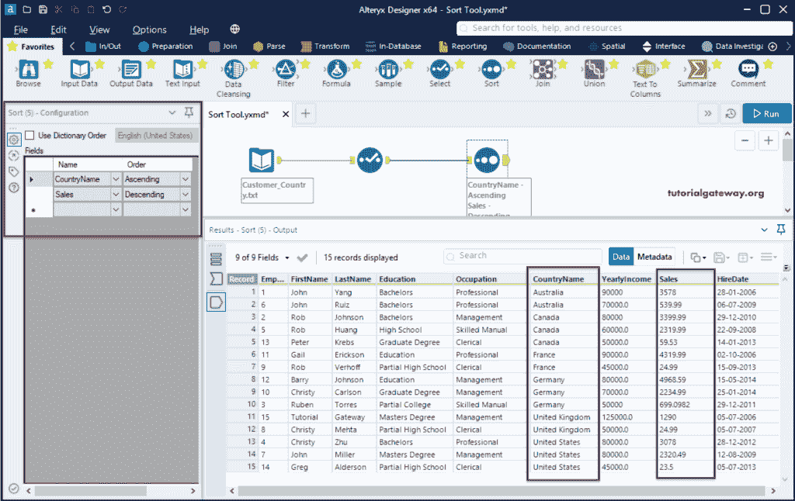