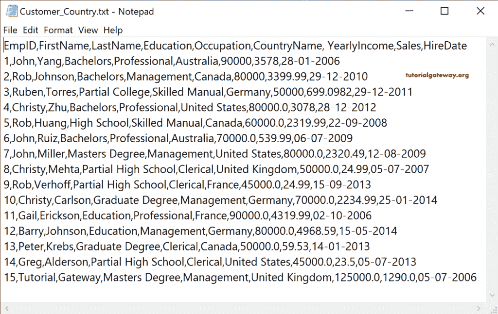
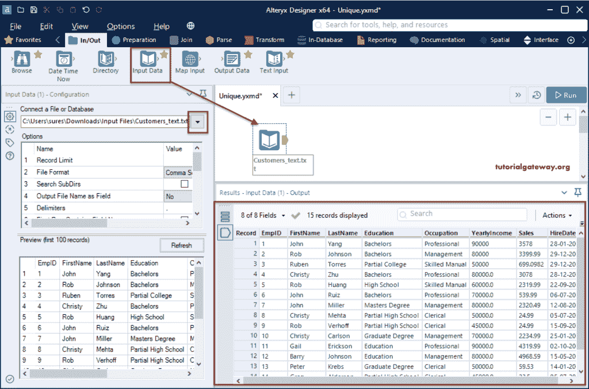
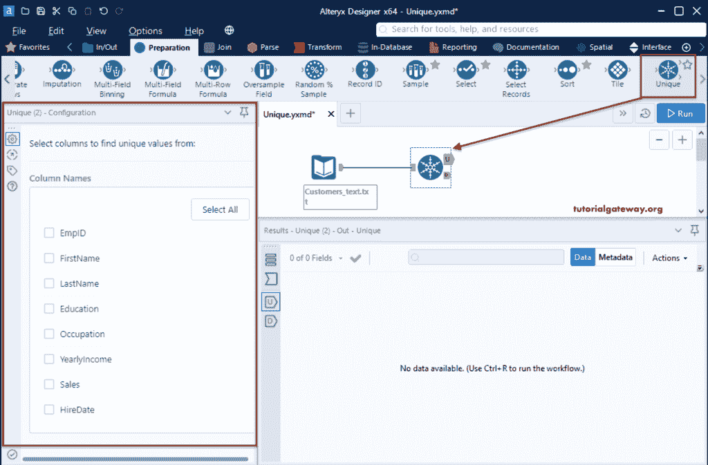
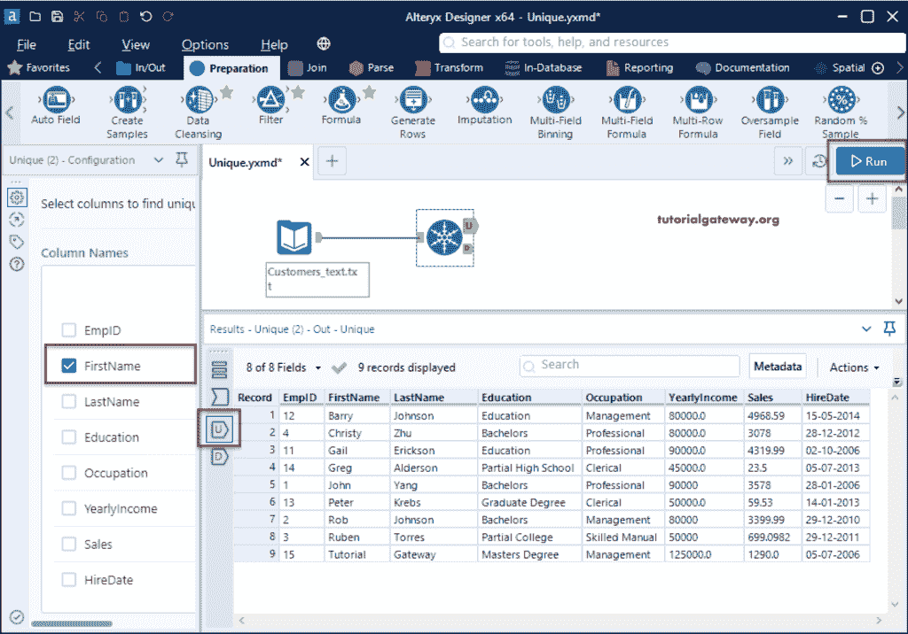
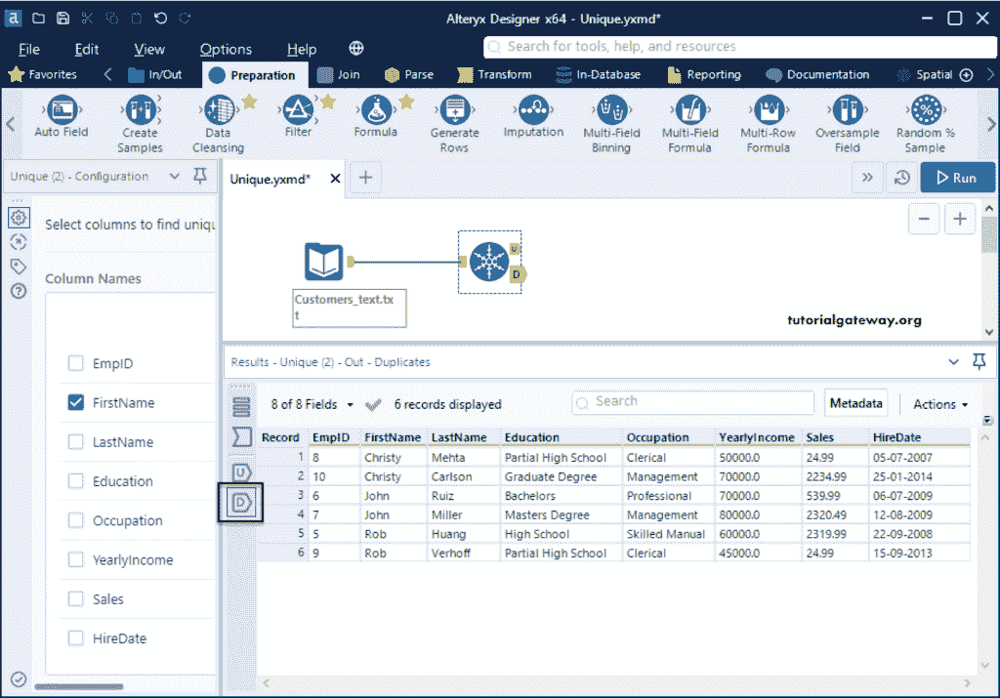
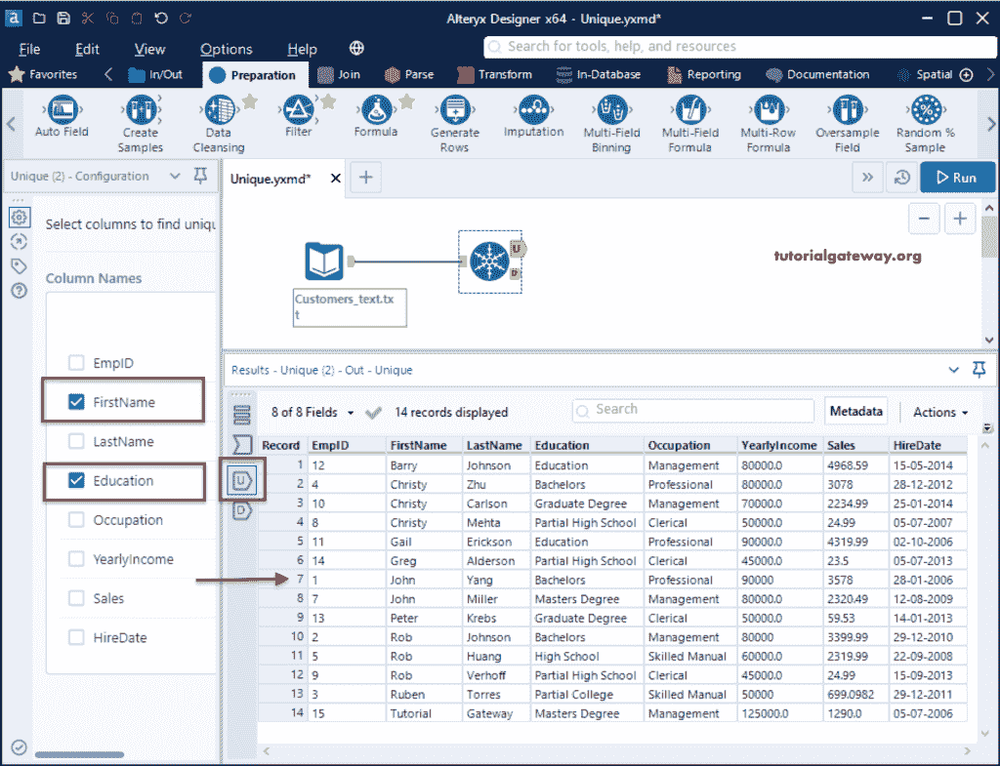
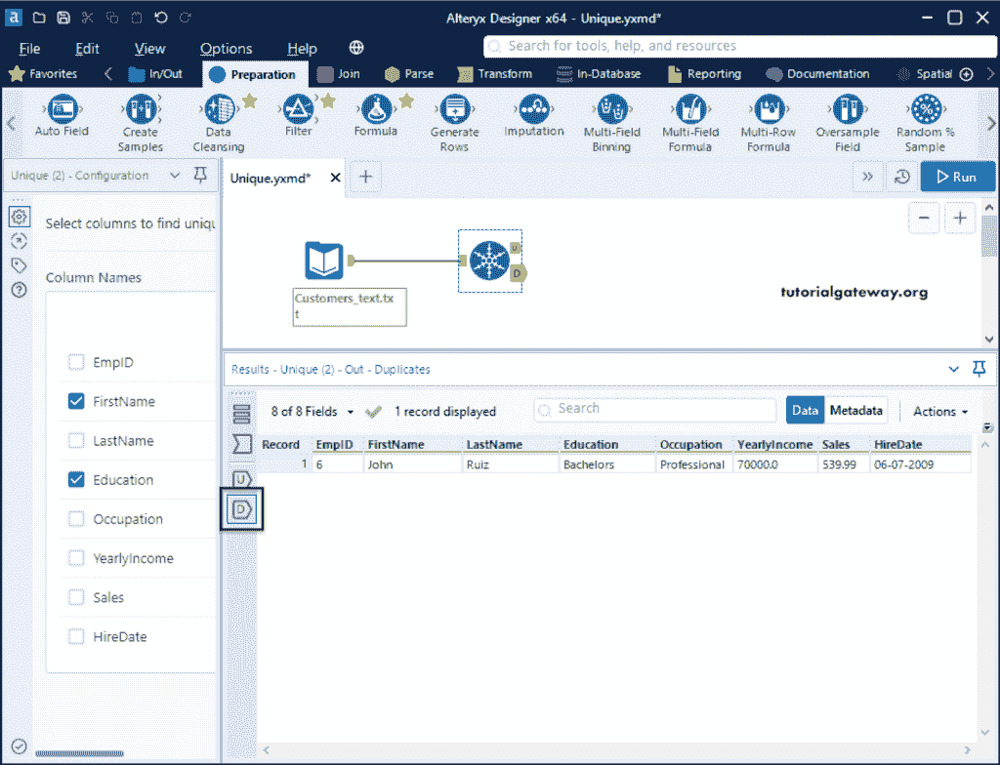
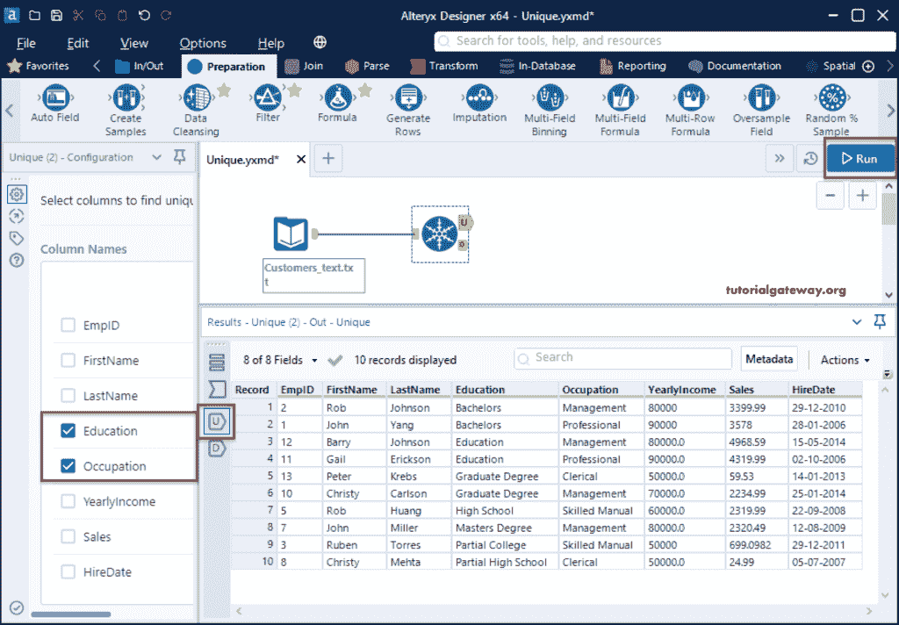
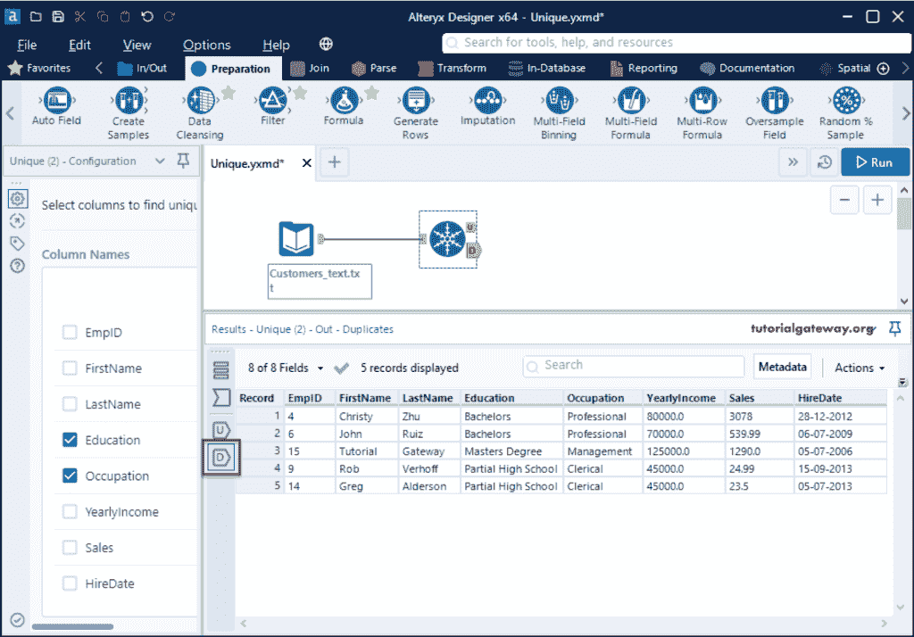

# Alteryx 唯一记录工具

> 原文：<https://www.tutorialgateway.org/alteryx-unique-records-tool/>

Alteryx Unique 工具有助于从源中找到不同的记录。该工具返回两个输出，它们是唯一记录(U)和重复记录(D)。为了演示这个 Alteryx 独特工具，我们使用了 Customer_Country 文本文件。

首先，拖放输入数据，并从连接文件或数据库选项配置选项卡中选择客户国家文本文件。

## Alteryx 唯一记录工具示例

请转到“准备”选项卡，并将“唯一”工具拖放到画布上。接下来，将输入连接到这个独特的工具。如您所见，独特有两个输出 U 和 d。

在 Alteryx 唯一记录工具配置选项卡中，我们有来自源的所有可用列的列表。在这里，您必须选择不同的列。

让我选择名字的含义，它将返回名字不同的所有客户。

如果您查看 D 输出，即重复，您可以看到所有重复的名字。

这一次，我们选择了名字和教育。请记住，当您选择多个列时，它必须匹配所有这些列。这个 [Alteryx](https://www.tutorialgateway.org/alteryx-tutorial/) 独特的例子返回所有名字和学历不同的客户。

只有一条重复的记录，那条记录是。

这里，我们选择了教育和职业。Alteryx 唯一记录工具返回所有教育和职业不同的客户。

有五个重复的客户记录，点击 D 输出查看。

