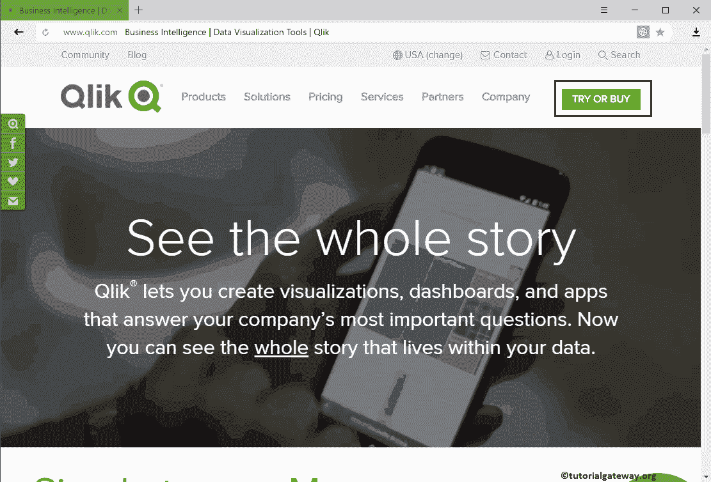
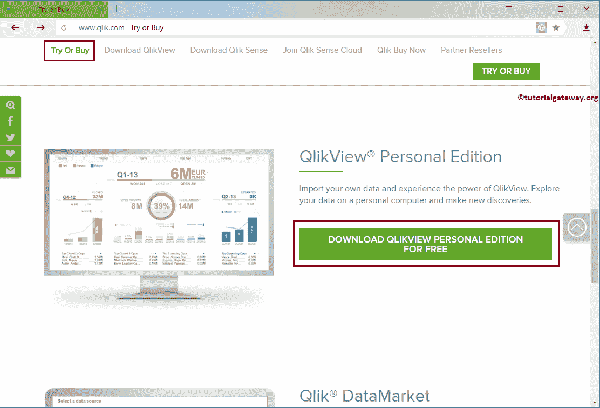
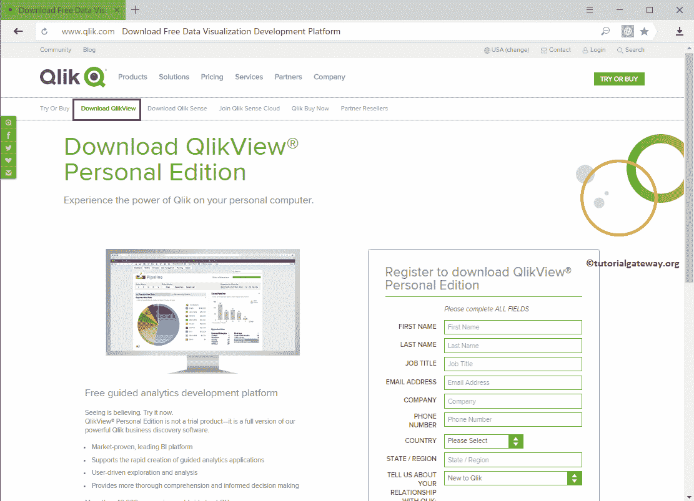
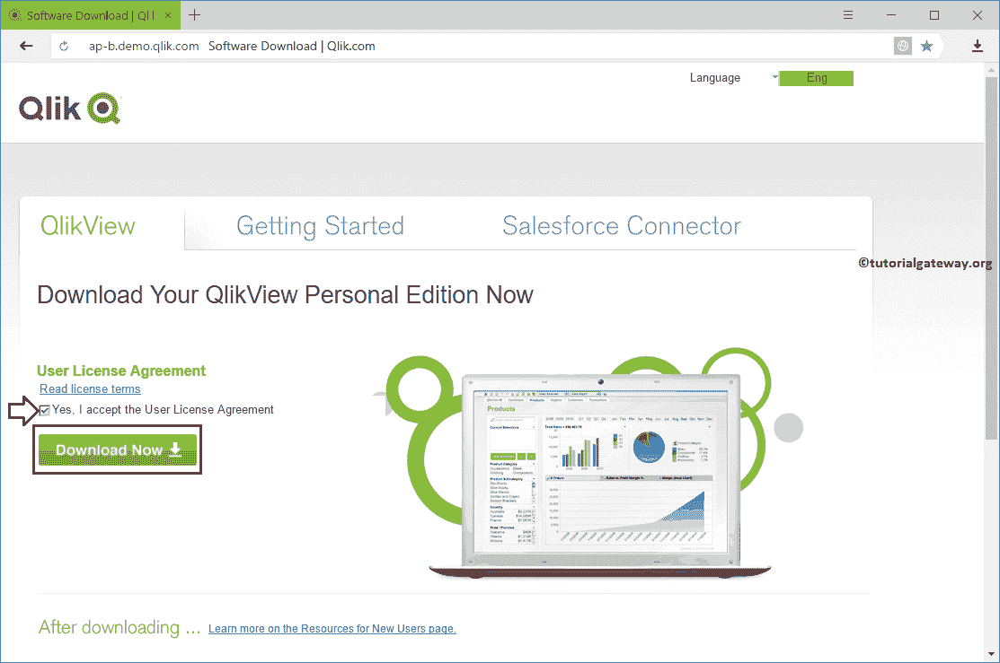

# 下载 QlikView

> 原文：<https://www.tutorialgateway.org/download-qlikview/>

在本文中，我们展示了从哪里或如何下载 QlikView 个人版以及截图。以下是软件下载中涉及的步骤。

## 下载 QlikView 的分步过程

要下载 QlikView，首先，去 Qlik 官方网站。在此，请查看该公司提供的产品、服务和解决方案。现在，点击 TRY 或 BUY 按钮找到个人版。

第二步:在 Qlik 网站的“试用或购买”页面中，上下滚动查找所有可用的产品。要保存个人版，请单击免费下载 QlikView 个人版按钮，或选择“试用”或“购买”选项卡旁边的下载 QlikView 选项卡。

第三步:点击下载 QlikView 选项卡或按钮，显示以下页面。为了保存个人版，请填写登记表登记详细信息。请填写所需的详细信息。

提交注册表单后，它会自动加载以下页面。请接受许可协议，然后单击下面显示的按钮开始该过程。

点击按钮，软件开始下载。此外，所需时间取决于互联网速度。

提示:请参考[安装 QlikView](https://www.tutorialgateway.org/install-qlikview/) 文章，了解安装 [QlikView](https://www.tutorialgateway.org/qlikview-tutorial/) 个人版的分步方法。