# 安装 QlikView

> 原文：<https://www.tutorialgateway.org/install-qlikview/>

在本文中，我们用截图展示了安装 QlikView 个人版(无论版本如何)的分步过程。

步骤 1:如果您有安装光盘、DVD 或任何介质，请将安装介质插入驱动器以安装 QlikView。或者，从网站下载 QlikView 软件，然后双击 QlikViewDesktop _ x64 setup . exe

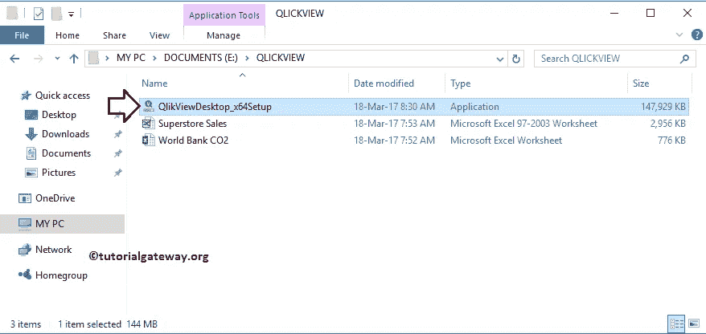

根据电脑安全设置，可能会出现此安全警告。如果是，那么点击

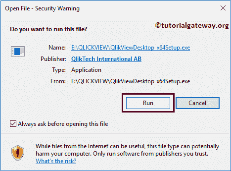

运行按钮

提示:请参考[下载](https://www.tutorialgateway.org/download-qlikview/)文章，了解下载 [QlikView](https://www.tutorialgateway.org/qlikview-tutorial/) 软件所涉及的步骤。

## 安装 QlikView 的步骤

步骤 2:单击 setup.exe 打开一个名为 QlikView InstallShield 向导的新安装向导。请根据需要选择语言，然后单击“确定”按钮。

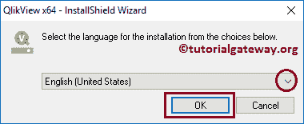

单击确定按钮后，向导会自动开始提取软件，如下所示。

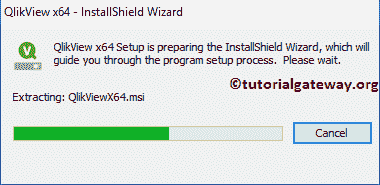

第三步:软件提取完成后，显示欢迎屏幕，开始安装过程。请单击“下一步”按钮开始实际的 QlikView 安装。

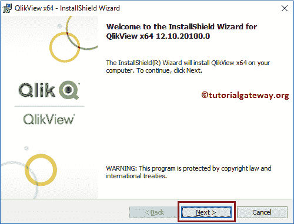

第 4 步:在许可协议页面下，请选择我接受许可协议单选按钮中的条款。

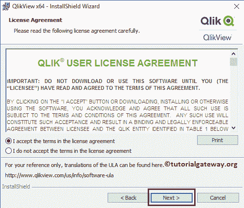

它显示“客户信息”页面。请提供用户名和组织名称。

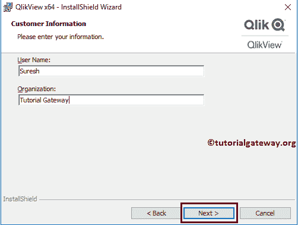

在“目标文件夹”页面下，可以通过单击“更改”按钮来更改默认安装文件夹。在这里，我们将保留默认设置并单击下一步按钮。

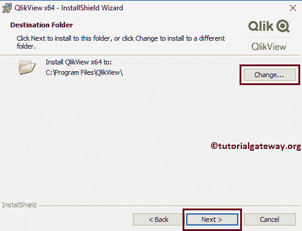

它询问是完全安装软件还是自定义设置(自定义选项)。请选择“完成”选项。

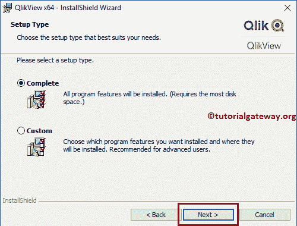

在准备安装程序页面下，请点击安装按钮

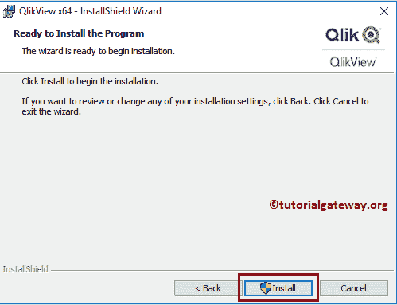

单击该按钮后，它会自动启动 QlikView 安装过程。请等到 100%完成。

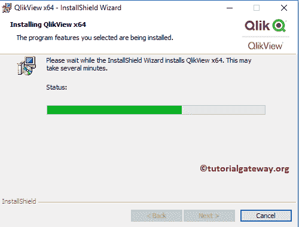

完成 QlikView 安装后，将显示以下页面。单击完成按钮完成 QlikView 安装过程。

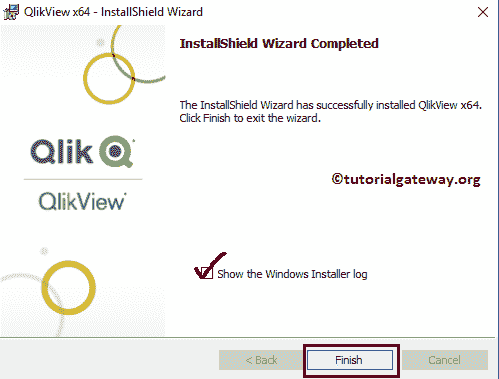