# 使用向导创建新的 QlikView 报告

> 原文：<https://www.tutorialgateway.org/create-new-qlikview-report-using-wizard/>

如何使用带有截图的向导创建新的 QlikView 报告？。出于演示的目的，我们使用这个 QlikView 报告向导创建了一个条形图和表框。

如果您在 Windows 7 或更高版本上运行，请在开始->所有程序-> QlikView 文件夹-> QlikView 中找到该应用。双击 QlikView 12(在您的情况下，版本可能不同)工具。它会打开 QlikView 个人版。第一页是起始页，不想再看到此页，请取消选中启动 QlikView 选项时显示起始页。

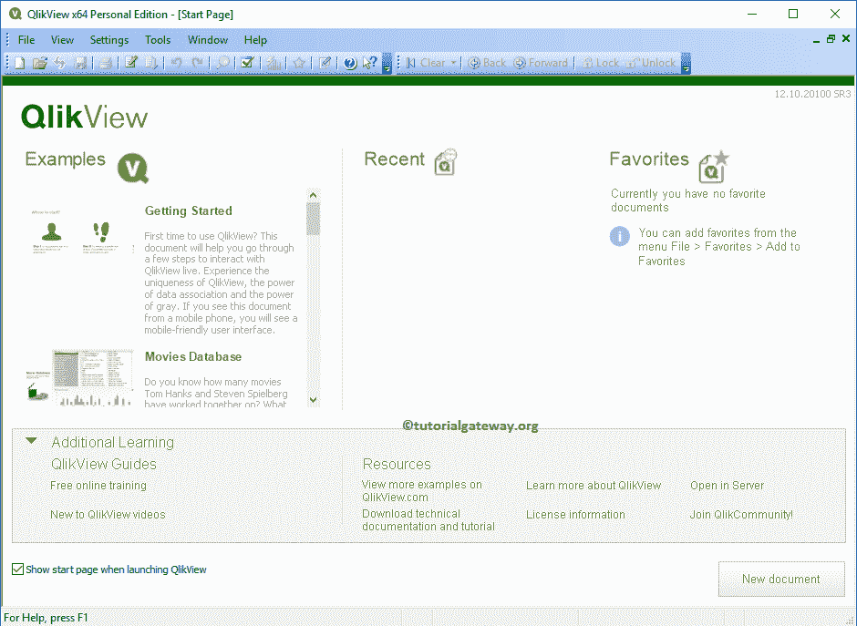

## 使用向导创建新的 QlikView 报告

我们可以通过多种方式创建新的 QlikView 报告:请导航到文件菜单，然后选择新建选项(或单击 Ctrl + N)。

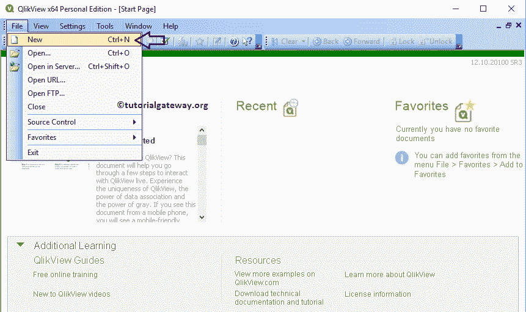

或者，单击 [QlikView](https://www.tutorialgateway.org/qlikview-tutorial/) 工具栏中的新建文档快捷方式。

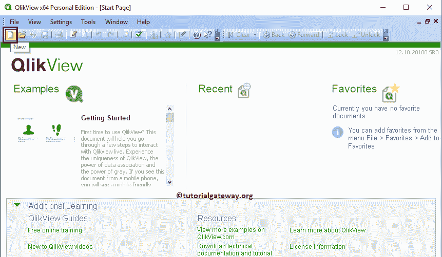

无论哪种方式，它都会打开一个新向导，帮助您使用向导创建新的 QlikView 报告。

步骤 1:数据源

使用此页面添加要在此报告中使用的数据源。这里我们想使用 Excel 文件。因此，我们单击“浏览”按钮来浏览文件系统。

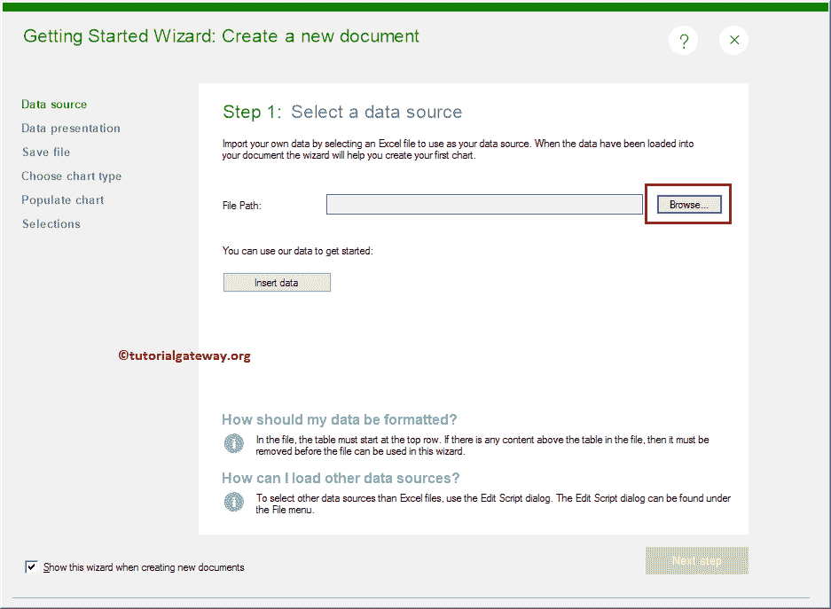

单击浏览按钮打开文档文件夹中的可用文件列表。请导航到保存数据的文件夹。从下面可以看到，我们通过单击“打开”按钮来选择 Excel 文件。

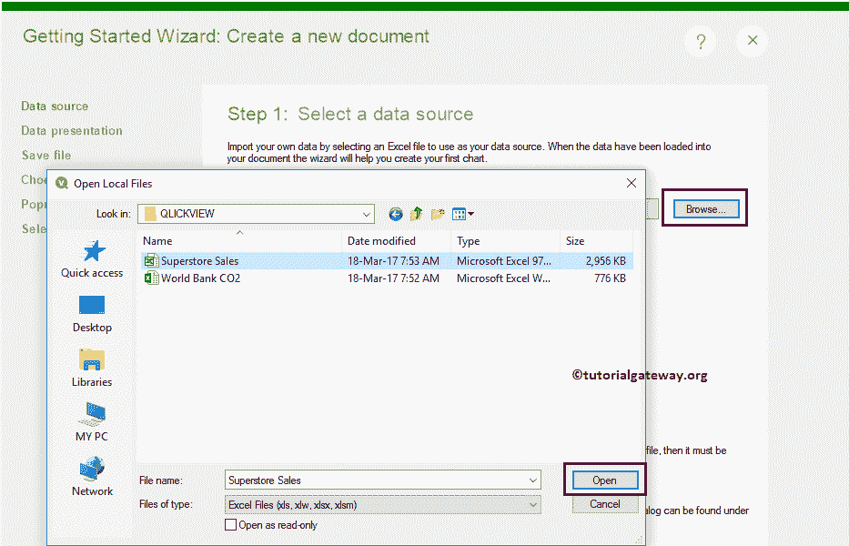

点击下一步按钮

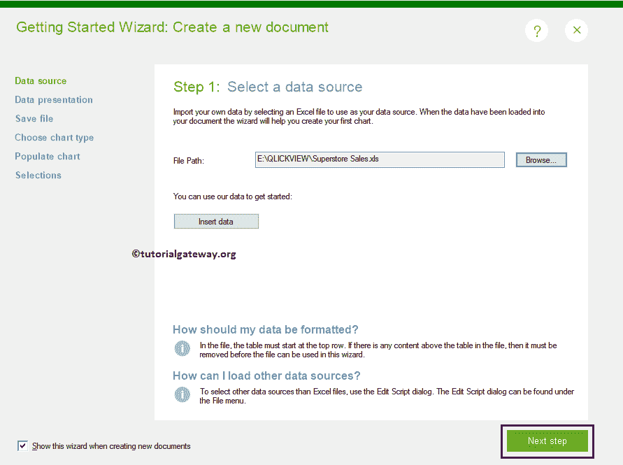

第二步:数据展示

这个页面对于查看加载的数据很有用，如果看起来是正确的，那就确认一下；否则，修改它。该页面的列标题下有两个选项:

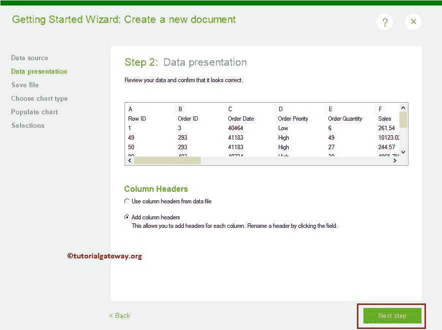

添加列标题:此选项允许向每列添加标题。单击字段将标题从默认字母(A、B、C..)换成更有意义的名字。如果数据没有任何列标题，则选择此选项。

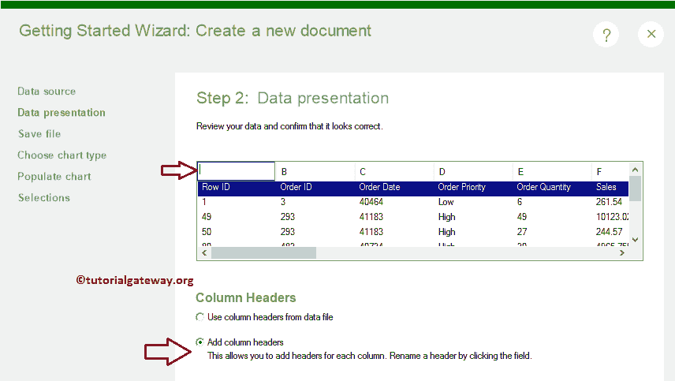

使用数据文件中的列标题:如果 Excel 文件的第一行包含列名，则选择此选项。通过选择此选项，QlikView 会自动将第一行数据分配给列标题。

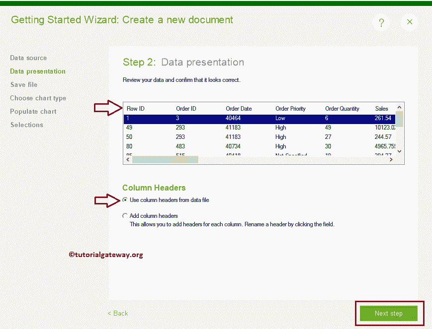

步骤 3:保存文件

单击“下一步”按钮打开“保存文件”页面，同时弹出“另存为”窗口来保存文件。如果未打开，请单击此页面上的另存为按钮。

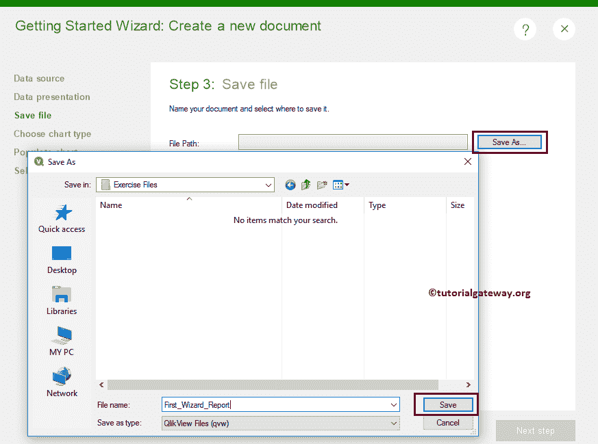

从下面的截图中，可以看到我们正在将报告保存为 First_Wizard_Report。

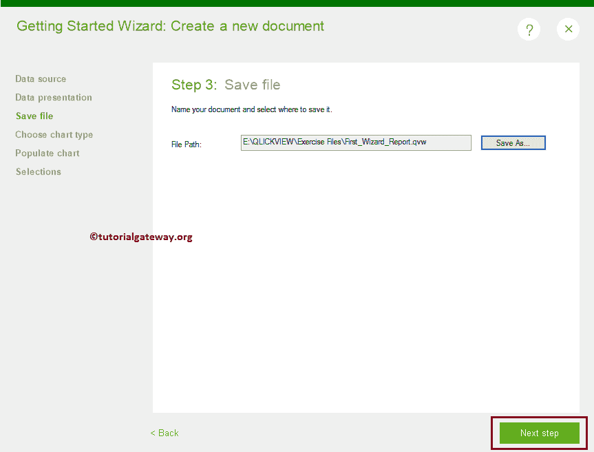

如果您正在创建第一个报告，则会出现此消息；否则，它不会。不管怎样，如果你找到这条信息，然后点击【确定】按钮

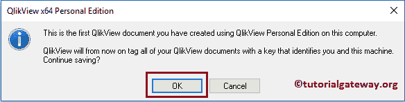

步骤 4:选择图表类型

此页面对于选择图表类型很有用。它提供了三个选项:条形图、折线图和饼图。请选择要设计的图表类型。例如，要设计一个[条形图](https://www.tutorialgateway.org/bar-chart-in-qlikview/)，通过点击选择按钮选择条形图选项。

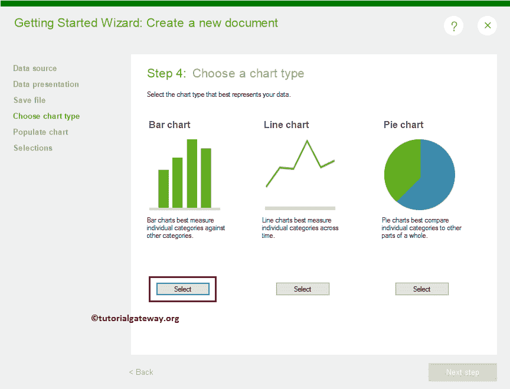

第五步:填充图表

接下来，我们必须为我们的条形图填充或分配数据。我们知道，QlikView 条形图需要一个 X 轴值和一个 Y 轴值。

*   尺寸:选择用作 X 轴的列。大多数情况下，我们使用维度数据，如类别、颜色、州、城市、国家、地区等。QlikView 提供了一个下拉框来选择维度数据的列名
*   表达式:在这里，选择用作 Y 轴的列。大部分是数字数据，应该汇总为总和、平均值或计数。

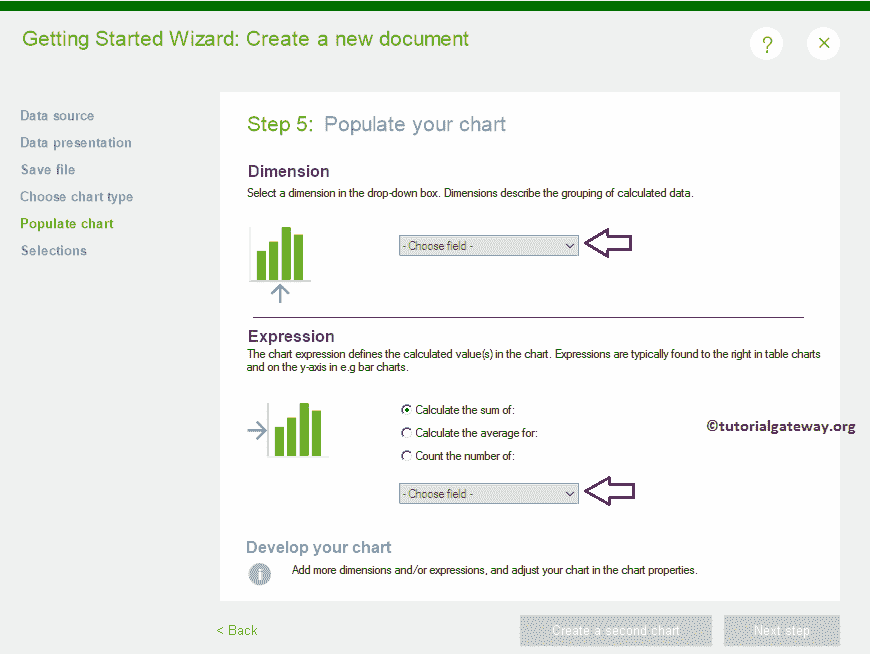

从下面的截图可以看到，我们选择了产品类别作为维度数据，利润总和作为表达式。请记住，我们的 excel 文件中只有 3 个产品类别。

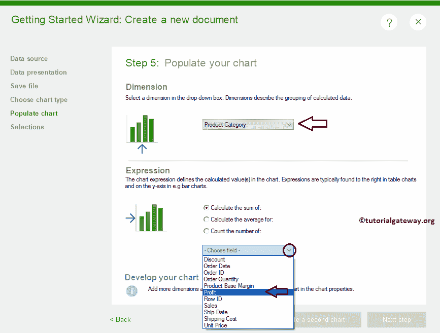

完成为条形图选择或填充数据后，请单击下一步按钮。

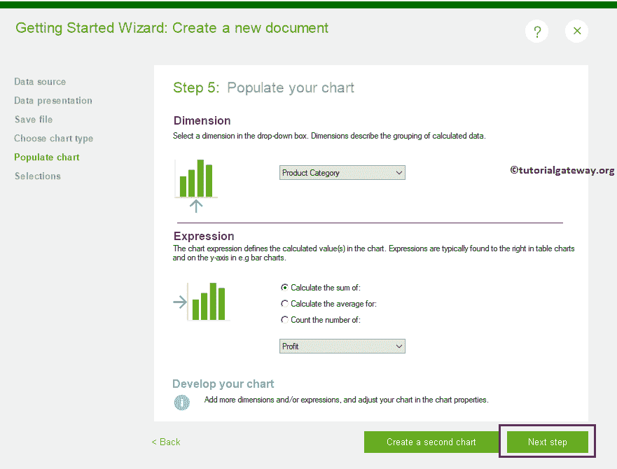

步骤 6:添加用于选择的对象

该页面允许添加列表框或[表框](https://www.tutorialgateway.org/creating-table-box-in-qlikview/)。将此框用作过滤器。这意味着选择任何项目都会改变我们条形图中的数据。现在谈论所有这些还为时过早。所以，专注于报告创建的只有

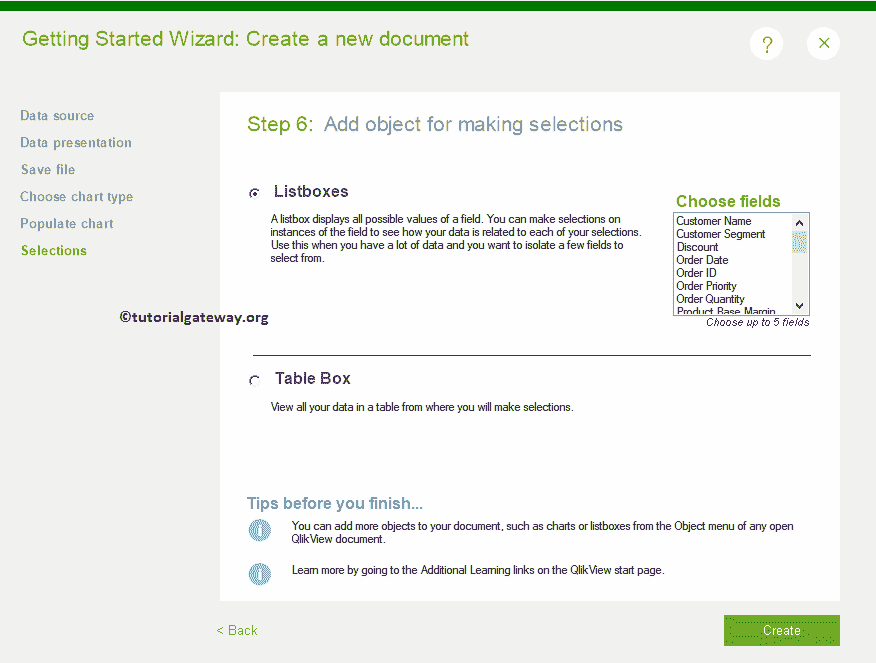

现在，我们选择表框

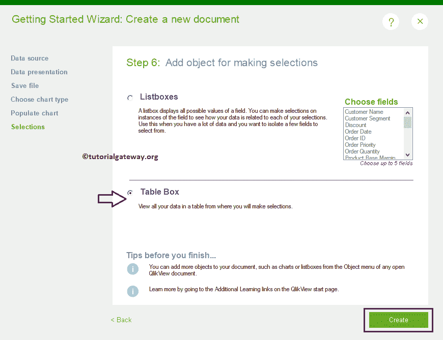

点击创建按钮，QlikView 创建一个新的报告。从下面的截图中，可以看到它在 X 轴上显示产品类别的条形图，在 Y 轴上显示利润总和。此外，“表”框显示了 Excel 文件中所有可用的行和列。

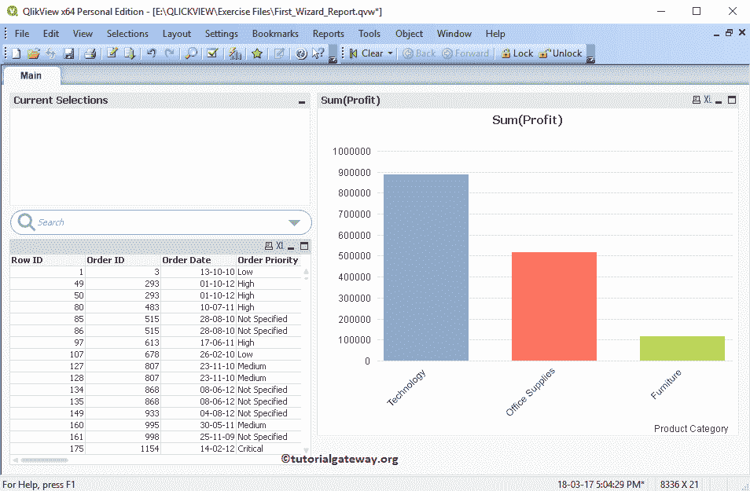

Hope 理解使用向导创建新 QlikView 报告的分步方法。