# 将数据从 Excel 导入 QlikView

> 原文：<https://www.tutorialgateway.org/import-data-from-excel-to-qlikview/>

在 QlikView 个人版中，我们不能使用数据库。这意味着，我们只能处理某些文件类型。本文将通过示例向您展示如何将数据从 Excel 导入 QlikView。

下面的截图将向您展示超级商店销售. xls Excel 文件中的数据。

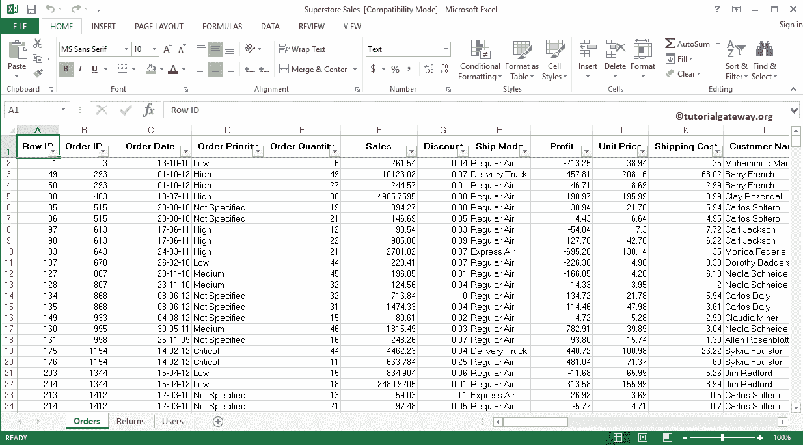

## 将数据从 Excel 导入 QlikView

请打开 QlikView 个人版，并点击工具栏中的编辑脚本快捷方式。

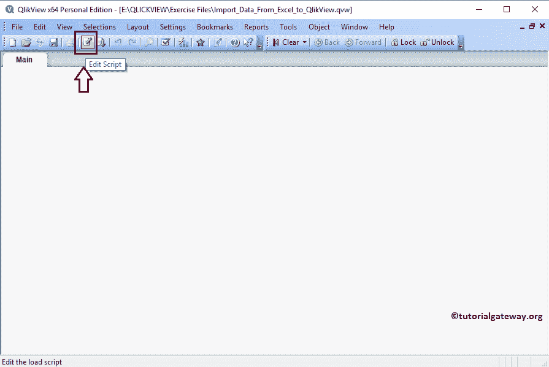

单击编辑脚本快捷方式后，将打开一个名为编辑脚本的新窗口。从下面的截图可以看到，QlikView 已经生成了一些默认的 SET 语句。如果您使用的是许可版本，则可以使用此窗口从所有来源导入数据。但是，当我们使用个人添加时，我们只能使用 Excel 文件、网络文件、文件数据和 QlikView 文件。

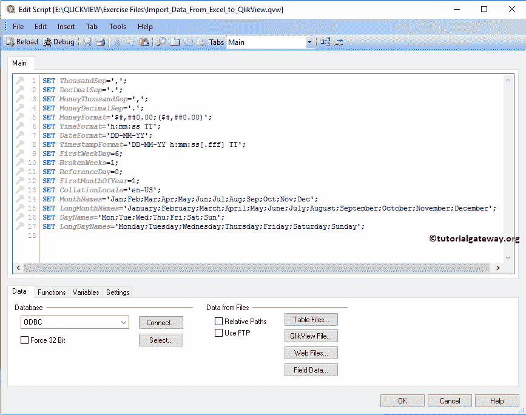

在这个例子中，我们将把数据从 Excel 导入到 QlikView 中，所以我们点击了表文件..选项。选择此选项后，它将打开文件系统中可用文件的列表。请导航到您的 excel 文件所在的文件夹，然后选择 excel 文件，如下所示。

提示:始终建议选中相对路径选项。这样，QlikView 将在 Load 语句

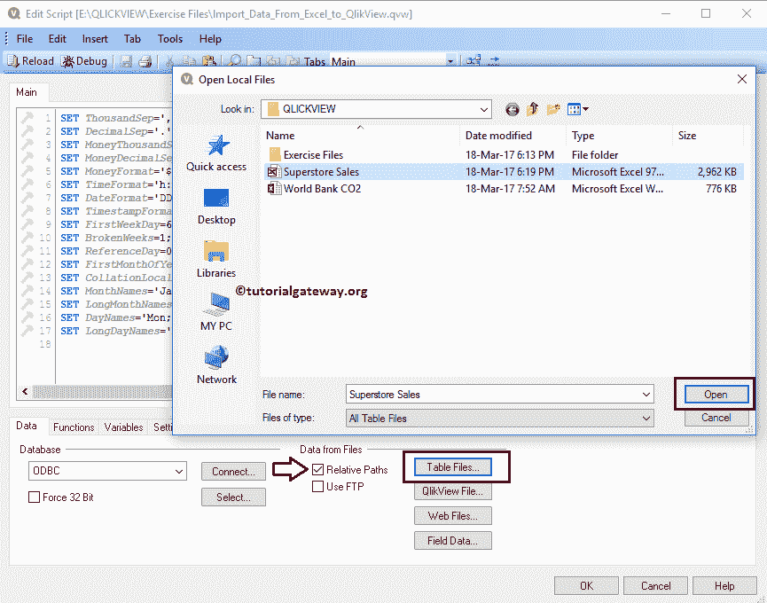

中使用动态路径作为源

选择所需文件后，将打开一个名为“文件向导:类型”的新弹出窗口，如下所示。

*   文件类型:如您所见，QlikView 足够智能，可以选择文件类型，如果有错误，您可以根据自己的要求进行更改。
*   表:该下拉列表将从文件中选择第一个表(或工作表)。但是，你可以根据你的要求改变。虽然我们的 excel 文件中有三张表，但现在我们将只关注这个订单表。
*   标签:用于指定工作表是否将列名作为第一行。

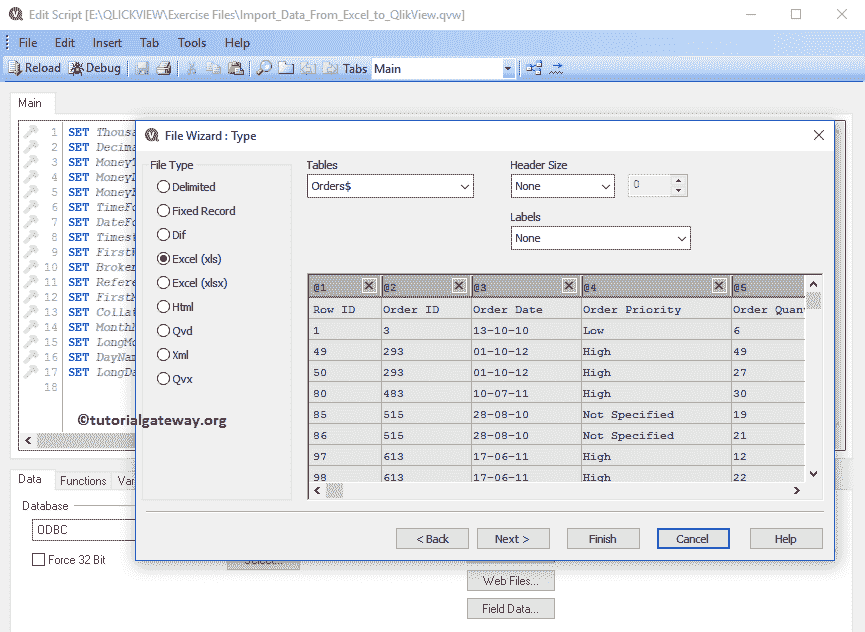

从数据中可以看出，我们的列名是 Orders 表的第一行。因此，我们选择了嵌入标签选项

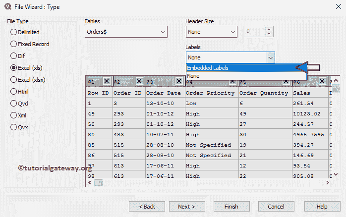

完成后，您可以单击“完成”按钮完成数据导入。让我来告诉你，当你点击【下一步】按钮

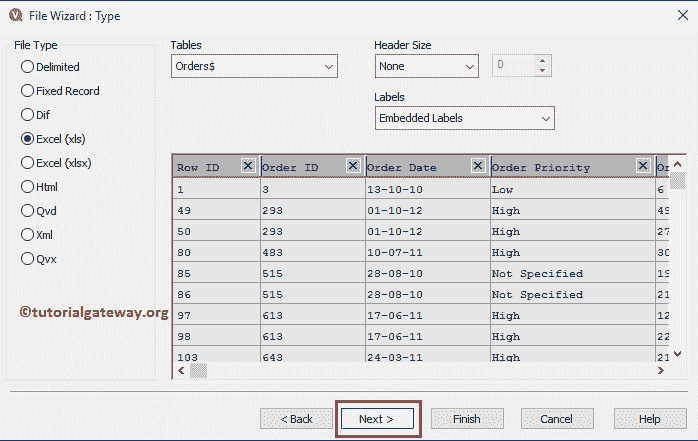

时会发生什么

单击“下一步”按钮后，将打开以下页面。您可以使用此页面格式化表中的错误数据。

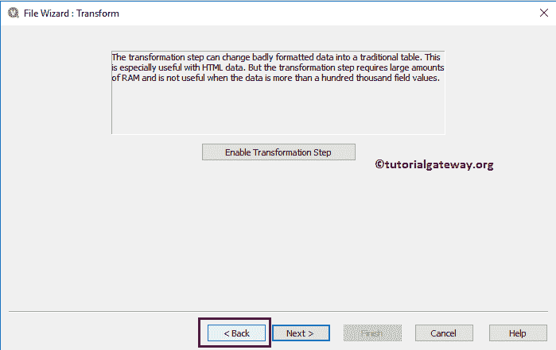

我们将在接下来的文章中解释这些特性，现在点击返回按钮，然后点击完成按钮

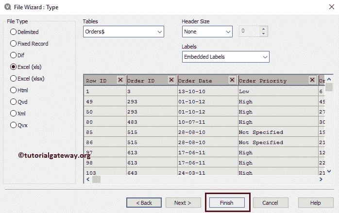

单击“完成”按钮后，将生成一个 LOAD 语句，列出我们的 excel 文件中所有可用的列。

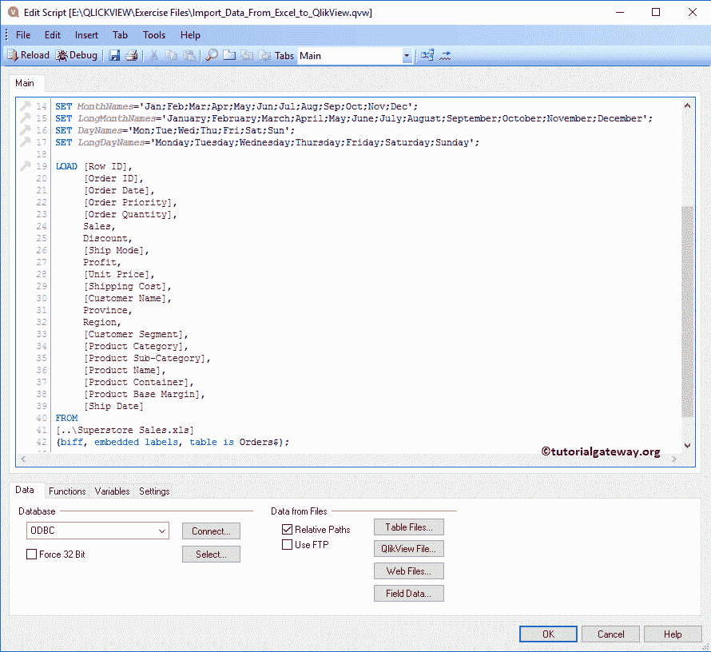

接下来，我们将向该数据源或数据表添加一个名称作为 QlikDataSource

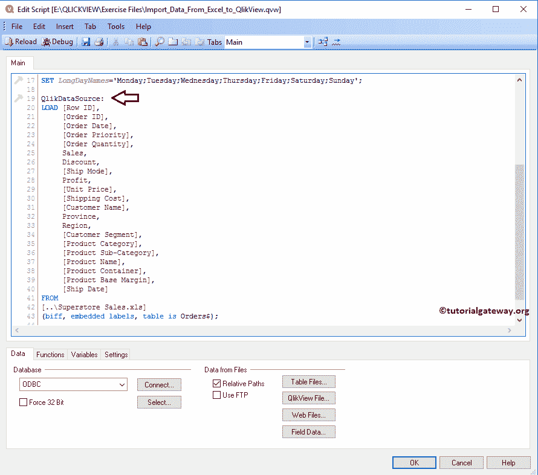

完成数据后，请单击保存保存数据源并重新加载按钮。这个重新加载按钮会将数据加载到报告中，这样我们就可以将这个数据源用于我们将要创建的报告。

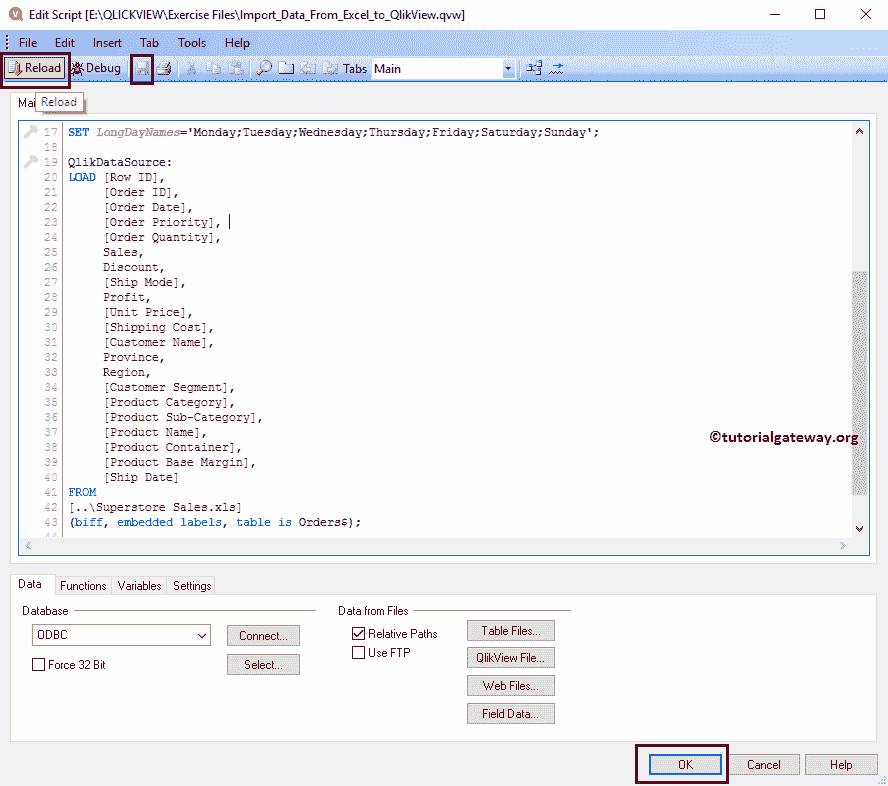

单击重新加载按钮后，将打开以下窗口。您也可以使用此窗口将字段添加到列表框中。一般情况下，我们会保持原样，点击

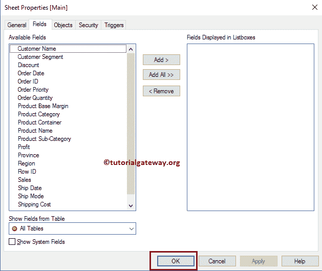

确定按钮

在关闭此窗口之前，让我将“客户名称”字段添加到“列表”框中，以便演示。单击应用按钮后，QlikView 报告将显示包含所有现有客户名称的列表框。

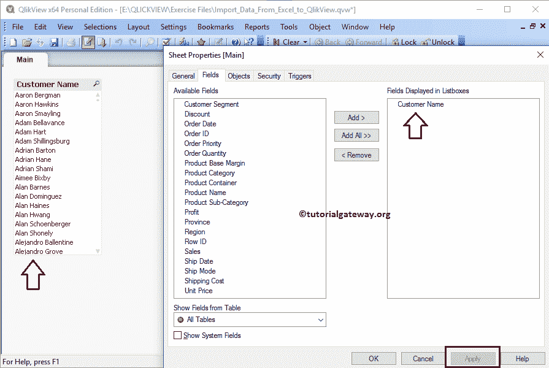