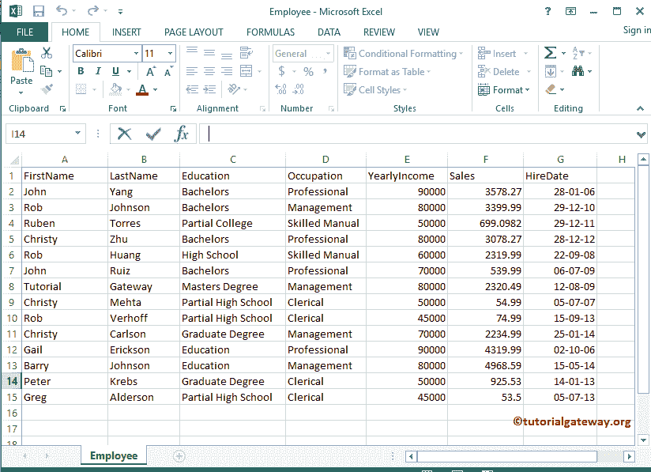
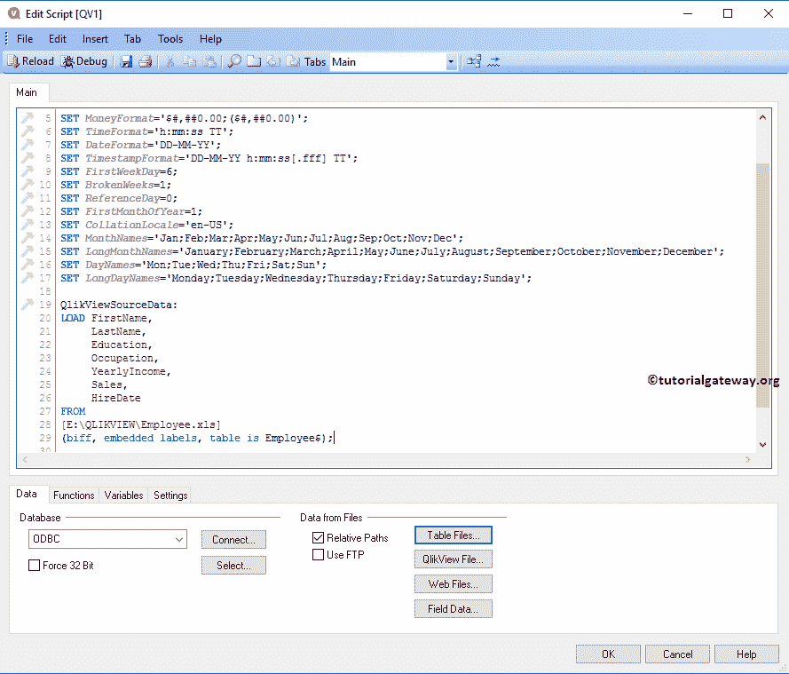

# QlikView 中的列表框

> 原文：<https://www.tutorialgateway.org/list-box-qlikview/>

QlikView 中的列表框是最基本的工作表对象，用于显示所选列中的所有记录。在 QlikView 示例中创建列表框时，我们将使用下面 Excel 表格中的数据。

从下面的截图中，可以看到我们正在将上面指定的员工 excel 表加载到 QlikView 中。

## 在 QlikView 中创建列表框

我们可以通过多种方式创建 QlikView 列表框:请导航到布局菜单，选择新建工作表对象，然后选择列表框..选项

第二种方法是右键单击空报告区域将打开上下文菜单。接下来，请选择“新建工作表对象”，然后选择显示的选项。或者，单击工具栏中的创建列表框快捷方式。

无论哪种方式都会打开一个新窗口

*   标题:QlikView 列表框的自定义标题。
*   字段:请选择要在其中显示的列名。例如，要显示数据库中的州名，请选择州列作为字段。
*   用作标题:复选标记此选项使用列名作为标题。

从下面的截图中，可以看到我们选择了职业作为归档值。接下来，我们使用文件名作为标题。参考[将数据从 excel 导入到 QlikView](https://www.tutorialgateway.org/import-data-from-excel-to-qlikview/) 将 Excel 表格导入到 [QlikView](https://www.tutorialgateway.org/qlikview-tutorial/) 中。

让我以升序对 QlikView 列表框数据进行排序，以便轻松找到所需的字段。在这里，我们可以按升序或降序对职业数据进行排序。

请根据要求更改字体系列、样式和字体大小。从下面的截图，看到我们把字体改成了 Lucida Sans，并且字号改成了 11

现在，在 QlikView 中看到我们新创建的表列表框。

使用此 QlikView 列表框过滤图表中的数据或工作表中的其他框。为了演示这一概念，我们将在现有工作表中添加一个[条形图](https://www.tutorialgateway.org/bar-chart-in-qlikview/)。

从下面的截图中，可以看到我们在其中选择了专业、管理字段。条形图仅显示管理栏和专业栏。

使用清除快捷方式撤销列表框过滤或选择

