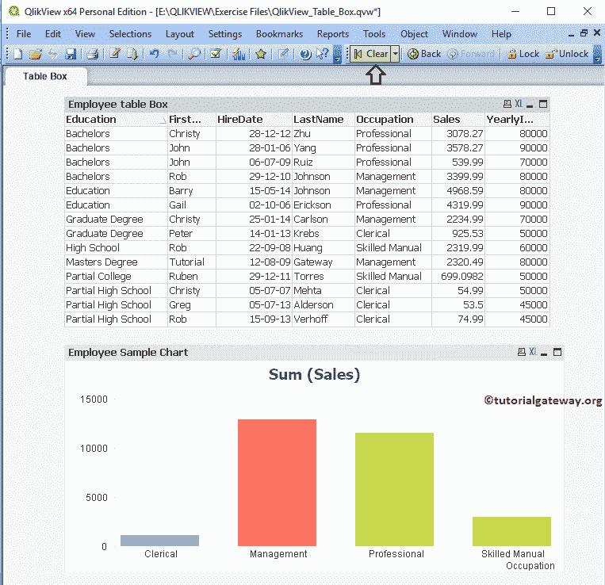

# 在 QlikView 中创建表格框

> 原文：<https://www.tutorialgateway.org/creating-table-box-in-qlikview/>

QlikView 中的表格框是一个工作表对象，用于同时显示一个或多个内部表中的几个不同字段。让我们通过一个例子来看看在 QlikView 中创建一个表格框的步骤。对于这个 QlikView 表格框演示，我们将使用下面的 Excel 表中的数据。

从下面的截图中，可以看到我们正在将上面指定的 excel 工作表加载到 QlikView 中。

在“主”选项卡上单击鼠标右键，然后选择“图纸属性”..根据要求更改选项卡名称。在这里，我们将其更改为表格框

## 在 QlikView 中创建表格框

我们可以通过多种方式创建 QlikView 表格框:请导航到布局菜单，选择新建工作表对象，然后选择表格框..选项

第二种方法是右键单击空报告区域，打开上下文菜单。请选择“新建工作表对象”，然后选择表格框..选项。或者，单击工具栏中的“创建表格框”快捷方式。

无论哪种方式，都会打开一个名为“新表格框”的新窗口。导入 excel 表请参考 [QlikView](https://www.tutorialgateway.org/qlikview-tutorial/) 中[将数据从 Excel 导入 QlikView](https://www.tutorialgateway.org/import-data-from-excel-to-qlikview/) 一文。

我们通过单击全部添加>>按钮将所有可用的字段添加到表格框中。虽然这个窗口有很多属性，但我们不会在本文中讨论它们。因此，单击应用应用更改，然后单击确定关闭窗口。请访问 QlikView 表格框属性文章，了解此窗口中的每个属性。

现在，在 QlikView 中查看我们新创建的表格报告。

使用此 QlikView 表格框过滤图表中的数据或工作表中的其他框。为了演示这个概念，我们在现有的表格框表中添加了一个[条形图](https://www.tutorialgateway.org/bar-chart-in-qlikview/)。

从下面的截图中，可以看到当我们点击表格框中的专业行时。条形图仅显示专业人员栏。

使用清除快捷方式撤销过滤器或选择

