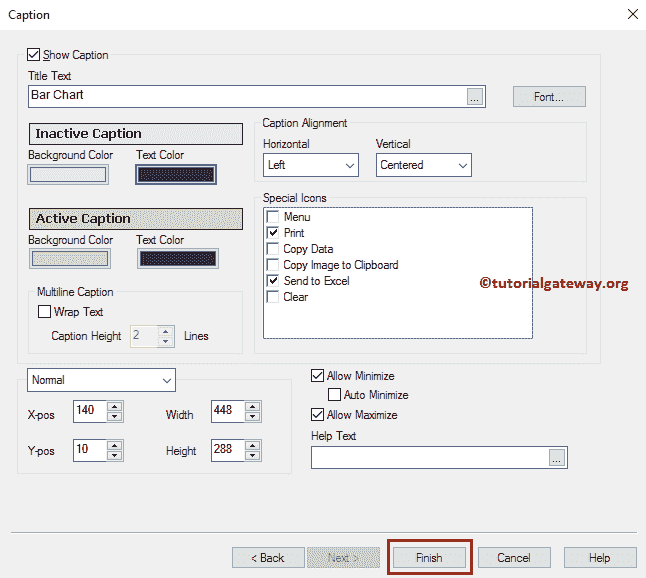

# QlikView 中的条形图

> 原文：<https://www.tutorialgateway.org/bar-chart-in-qlikview/>

QlikView 中的条形图对于直观地比较数据非常有用。让我们通过一个例子来看看在 QlikView 中创建条形图的步骤。对于这个 QlikView 条形图演示，我们将使用下面 Excel 表中的数据。

例如，如果我们想按国家、地区或大陆检查销售额，我们可以使用 QlikView 条形图。通过查看这个 QlikView 条形图，人们可以了解哪个国家或地区的表现比其他国家或地区更好。

从下面的截图中，可以看到我们正在将上面指定的 excel 工作表加载到 QlikView 中。

## 在 QlikView 中创建条形图

在这个 QlikView 条形图示例中，我们发现哪种颜色的产品比另一种颜色的产品表现更好。为此，我们在 X 轴上使用颜色列，在 Y 轴上使用销售额表达式。

我们可以用多种方法创建 QlikView 条形图:请导航到布局菜单，选择新建工作表对象，然后选择图表..选项

第二种方法是右键单击报告区域打开上下文菜单。请选择新工作表对象，然后选择图表..选项。

无论哪种方式都可以在 QlikView

中打开一个新窗口来创建条形图

第一步-概述:从下面的截图中，看到我们给它分配了一个新的名称，然后选择了条形图作为类型

步骤 2–尺寸:请选择要在 X 轴中使用的尺寸列。

*   可用字段/组:此部分下显示的所有可用列或组的列表。
*   使用的维度:条形图中使用的该部分中的所有列。
*   添加:此按钮将可用列添加到已用列部分。
*   移除:此按钮从“已用列”部分移除列。
*   添加计算维度:它打开“编辑表达式”窗口来编写自定义表达式。

现在，我们正在将“颜色”维度添加到“已用维度”部分。导入 excel 表请参考 [QlikView](https://www.tutorialgateway.org/qlikview-tutorial/) 中[将数据从 Excel 导入 QlikView](https://www.tutorialgateway.org/import-data-from-excel-to-qlikview/) 一文。

步骤 3–表达式:单击维度页面上的下一步按钮打开表达式页面，在此之上，会打开一个弹出窗口。使用此 QlikView 条形图窗口为 Y 轴数据编写自定义表达式，或选择列。

在这里，我们选择“备案”作为“销售额”，选择“合计”作为“总和”。记住，如果你知道如何写一个表达式，那么把它写在表达式 OK 部分下面的空白处。

点击确定按钮，编辑表达式窗口关闭。

*   标签:默认情况下，“定义”部分下的文本显示为 Y 轴标签。意思是，总和(销售额)。要更改默认文本，请将自定义文本放在此部分下。
*   数据点上的值:它显示数据点或其中每个条的数据标签。它表示显示在每个彩色条顶部的销售额。

步骤 4–排序:在此部分下，我们可以指定 x 轴上尺寸的排序顺序。

第五步-风格:这个 QlikView 条形图页面是为了改变风格或外观。在这里，我们可以选择三维、水平、垂直或 2D 条形图。

从下面的截图中，看到我们已经选择了标准的条形图

步骤 6–演示:在这里，我们可以更改 QlikView 条形图的条形图设置。

坐标轴:使用此坐标轴页面更改坐标轴设置。

第八步——颜色:这个页面对改变它的颜色模式很有帮助。这里，我们选择多色选项。借此，它为不同颜色的产品显示不同的颜色。

步骤 9–数字:使用此 QlikView 条形图页面设置表达式值的格式。它只反映当我们显示数据标签或数据点时。例如，这里我们在 y 轴上显示销售金额总和。众所周知，是钱让我们可以选择钱。

第 10 步-字体:请根据要求更改字体系列、样式和字体大小。所有这些变化都反映在图表格报告

中

步骤 11–布局:当我们选择阴影条形图时，它显示了改变阴影强度等的设置。使用此页面对其进行修改。

第 12 步-标题:使用此页面来风格化 QlikView 条形图标题。比如它的颜色、背景、位置等。完成后，单击“完成”按钮。

现在，在 QlikView 中查看我们新创建的条形图。

