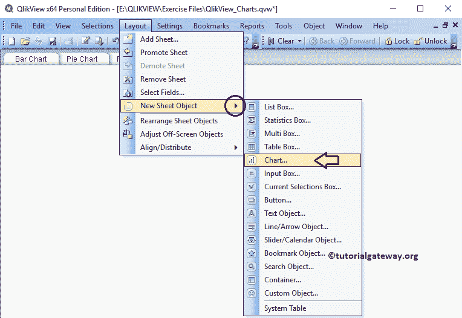

# QlikView 中的块图

> 原文：<https://www.tutorialgateway.org/block-chart-in-qlikview/>

QlikView 中的块图对于可视化文本数据非常有用。例如，如果你正在一个网站或趋势推特上寻找最常用的标签，那么使用这个 QlikView Block 图表。让我们通过一个例子来看看如何在 QlikView 中创建一个块图。为此，我们将使用下表中的数据。

从下面的截图中，可以看到我们正在将上面指定的 excel 工作表加载到 QlikView 中。

## 在 QlikView 中创建块图

在本例中，我们为数据源中存在的所有状态创建了一个块图。为此，我们使用状态列作为维度数据，使用销售额表达式作为块大小。

我们可以用多种方法创建 QlikView 块图:请导航到布局菜单，选择新建工作表对象，然后选择图表..选项

另一种方法:右键单击报告区域打开上下文菜单。请选择新工作表对象，然后选择图表..选项。

无论哪种方式，它都会打开一个新窗口，在 QlikView 中创建一个块图。从下面的截图中，可以看到我们给我们的图表分配了一个新的名字叫做【块图示例】，然后选择了【块图】作为图表类型

请选择要在块图中使用的维度列。对于本例，我们将状态维度添加到已用维度部分。这意味着它为每个状态创建一个单独的块。参见 [QlikView](https://www.tutorialgateway.org/qlikview-tutorial/) 中[将数据从 excel 导入 QlikView](https://www.tutorialgateway.org/import-data-from-excel-to-qlikview/) 一文，了解导入 Excel 表。

单击“下一步”按钮会打开“表达式”页面，在此之上，会打开一个名为“编辑表达式”的弹出窗口。使用此窗口为 QlikView 块图数据编写自定义表达式，或选择列。

这里，我们在表达式 OK 部分下编写一个表达式。如果您不知道如何编写表达式，请选择“作为销售额归档”、“作为总和汇总”，然后单击“粘贴”按钮。

单击确定按钮关闭块图编辑表达式窗口，然后单击下一步按钮。

下一页是改变方块图的外观和样式。在这里，我们将地块颜色样式更改为灯光渐变。

演示页面用于更改 QlikView 块图演示设置

“QlikView 颜色”页面更改块图的颜色模式。我觉得你应该和他们一起玩

接下来，我们将格式化表达式值。众所周知，销售金额的总和就是钱，我们选择的是钱。

使用此 QlikView 块图页面根据要求更改字体系列、样式和字体大小。从下面的截图，看到我们把字体= Segoe WP Black，字体大小改成了 11

使用此布局页面为块图提供阴影效果。或者通过单击“应用主题”按钮来应用自定义主题。这里，我们将阴影强度更改为柔和，边框宽度更改为 2(边框的额外厚度)。

标题页是 QlikView 块图标题的样式。在这里，我们可以更改块图的背景、位置、颜色等。在这里，我们更改了标题文本颜色。完成后，单击“完成”按钮。

现在，在 QlikView 中查看我们新创建的块图。

让我们把鼠标悬停在新南威尔士州。从下面的截图中，可以看到它正在显示州名和销售额(数据标签)。

