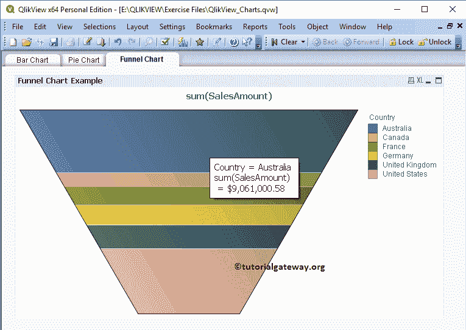

# QlikView 中的漏斗图

> 原文：<https://www.tutorialgateway.org/funnel-chart-in-qlikview/>

QlikView 中的漏斗图对于显示不同阶段的数据流或数据非常有用。我们可以使用 QlikView 漏斗图来可视化生产每个阶段的浪费成本或生产成本。对于这个 QlikView 漏斗图演示，我们将使用下面 Excel 表中的数据。

从下面的截图中，可以看到我们正在将上面指定的 excel 工作表加载到 QlikView 中。

## 在 QlikView 中创建漏斗图

在本例中，我们为数据源中可用的国家列表创建了一个 QlikView 漏斗图。为此，我们将使用国家/地区列作为维度数据，使用销售金额表达式作为流量大小。

我们可以通过多种方式创建 QlikView 漏斗图:请导航到布局菜单，选择新建工作表对象，然后选择图表..选项

另一种方法:右键单击报告区域选择新建工作表对象，然后选择图表..选项。

无论哪种方式，它都会打开一个新窗口来创建漏斗图。从下面可以看到，我们给我们的图表分配了一个新的名称叫做漏斗图示例，然后选择了漏斗图作为图表类型

请选择要在漏斗图中使用的维度列。对于此漏斗图示例，我们将国家维度添加到已用维度部分。参见 [QlikView](https://www.tutorialgateway.org/qlikview-tutorial/) 中[将数据从 excel 导入 QlikView](https://www.tutorialgateway.org/import-data-from-excel-to-qlikview/) 一文，了解导入 Excel 表。

单击“下一步”按钮会打开“表达式”页面，在此之上，会打开一个名为“编辑表达式”的弹出窗口。使用此 QlikView 漏斗图窗口为漏斗图数据编写自定义表达式，或选择列。

从下面的截图中，看到我们正在表达式 OK 部分下写一个表达式。如果您不知道如何编写表达式，请选择“作为销售额归档”、“作为总和汇总”，然后单击“粘贴”按钮。

单击确定按钮关闭编辑表达式窗口，然后单击下一步按钮。

注意:由于我们没有对默认设置进行任何更改，因此在此阶段单击“完成”按钮将得到相同的结果。我们打算展示可用的选项，我们将在下一篇文章中讨论它们。

请指定国家维度的排序顺序。在这个 QlikView 漏斗图示例中，我们可以按名称升序对国家进行排序。

下一页是改变漏斗图的外观和风格。这里，我们保留默认设置。

演示页面用于更改 QlikView 漏斗图设置:

*   弹出标签:将鼠标悬停在漏斗图上时，会显示相应的维度名称和表达式值。在本例中，它将显示国家名称和销售额
*   显示图例:要不要显示图例？。如果是，勾选此选项，否则取消勾选。

“QlikView 漏斗图颜色”页面对于更改颜色模式非常有用。从下面的截图，看到我们改变了一点颜色。

接下来，我们将格式化表达式值。它仅在显示数据标签或悬停在区域上时才会反映出来。众所周知，销售金额的总和就是金钱，所以我们选择金钱。

请根据要求更改字体系列、样式和字体大小。从下面的截图中，看到我们把字体大小改成了 11

使用此布局页面为漏斗图提供阴影效果，或者我们可以通过单击应用主题按钮来应用自定义主题。

标题页是 QlikView 漏斗图标题的风格化。在这里，我们可以更改漏斗图的颜色、背景、位置等。完成后，单击“完成”按钮。

现在，在 QlikView 中查看我们新创建的漏斗图。

让我们把鼠标悬停在澳大利亚地区。从下面的截图中，QlikView 漏斗图显示了国家/地区名称和销售额(数据标签)。

