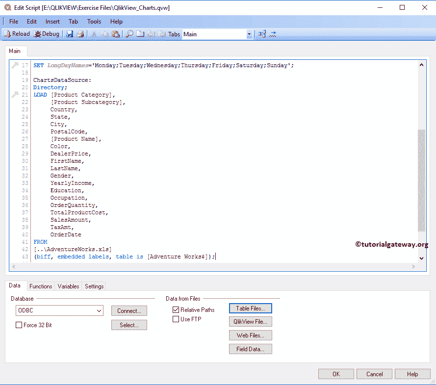

# QlikView 中的网格图

> 原文：<https://www.tutorialgateway.org/grid-chart-in-qlikview/>

QlikView 中的网格图类似于散点图。但是，QlikView 网格图使用 X 轴和 Y 轴上的维值，并使用表达式来可视化数据。要在 QlikView 中创建网格图表，请使用以下 Excel 表数据。

从下面的截图中，可以看到我们正在将上面指定的 excel 工作表加载到 QlikView 中，并将其用于网格图表。

## 在 QlikView 中创建网格图

在这个 QlikView 示例中，我们使用国家、颜色、职业列作为维度数据，使用销售额作为表达式来创建网格图表。

我们可以用多种方法创建 QlikView 网格图。第一种方法:请导航到布局菜单，选择新建工作表对象，然后选择图表..选项

另一种方法是右键单击报告区域，打开上下文菜单。请选择新工作表对象，然后选择图表..选项。

无论哪种方式，QlikView 都会打开一个新窗口来创建网格图。在这里，我们为网格图指定了一个名为“示例”的新名称，并选择网格图作为图表类型。

请选择要在网格图表中使用的维度(列)。在本例中，我们将“国家”、“颜色”、“职业”维度添加到“已用维度”部分。这意味着，它将在 X 轴上添加国家，在 Y 轴上添加颜色维度。请参考[将数据从 excel 导入到 QlikView](https://www.tutorialgateway.org/import-data-from-excel-to-qlikview/) 一文，将中的 Excel 表导入到 [QlikView](https://www.tutorialgateway.org/qlikview-tutorial/) 中。

单击“下一步”按钮会打开“表达式”页面，在此之上，会打开一个名为“编辑表达式”的弹出窗口。使用此窗口编写自定义表达式。

这里，我们在表达式 OK 部分下编写一个表达式。如果不知道如何编写表达式，请选择“作为销售金额归档”、“作为总和汇总”，然后单击“粘贴”按钮。气泡或符号的大小取决于该表达式值。

单击确定按钮关闭编辑表达式窗口，然后单击下一步按钮。

在此排序页面中指定维度的排序顺序。在这个 QlikView 网格图示例中，我们按照升序或降序对国家进行排序。

下一页是改变 QlikView 网格图的外观和样式。让我们将打印颜色样式更改为“浅渐变”，将打印区域背景样式更改为“最小”。

演示页面更改网格图表的演示。例如，更改符号大小、启用轴滚动等。现在，我们将符号大小更改为 3pt。

使用此轴页面更改 X 轴和 Y 轴设置。

“颜色”页面可用于更改 QlikView 网格图表的颜色模式。尝试不同的选项

格式化表达式值:众所周知，销售金额的总和就是钱，我们选择的是钱。

使用此 QlikView 网格图表字体页面更改字体系列、样式和字体大小。这里我们把 Font = Leelawadee，Font size 改为 11

使用此布局页面为网格图表提供阴影效果，或通过单击应用主题按钮应用自定义主题。从下面的截图，看到我们改变了阴影强度为强烈和边框宽度为 3。

标题页是 QlikView 网格图表标题的样式。在这里，更改网格图表的背景、位置、颜色等。从下面的截图，看到我们改变了活动文本的颜色和背景颜色。完成后，点击【完成】按钮

现在，在 QlikView 中查看我们新创建的网格图。

通过上面的图表满足了我们的要求，我们无法确定销售额最少的职业。让我们更改图表样式。为此，右键单击图表并从上下文菜单中选择属性选项。

单击属性选项将打开一个名为图表属性的新窗口。请导航到“样式”选项卡，并更改外观。

现在，请注意网格图显示的是[饼图](https://www.tutorialgateway.org/pie-chart-in-qlikview/)，而不是气泡图。

让我们将鼠标悬停在饼图上。请注意，它显示的是国家名称、颜色、职业和销售额(数据标签)。

请参考 [QlikView 散点图](https://www.tutorialgateway.org/scatter-chart-in-qlikview/)一文。