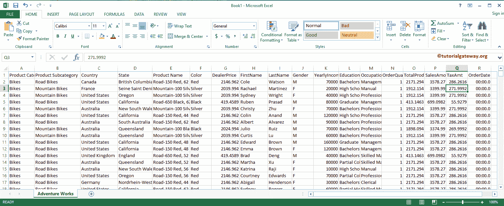
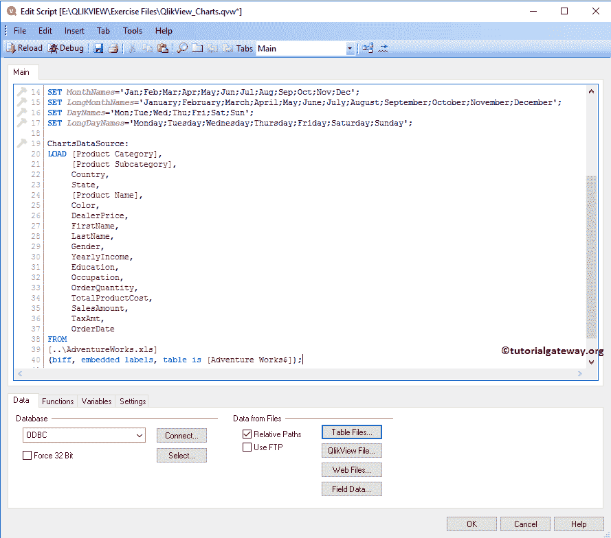
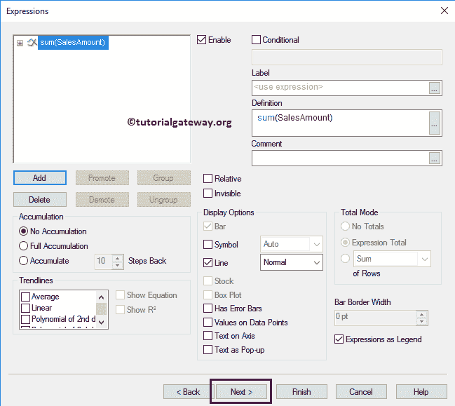
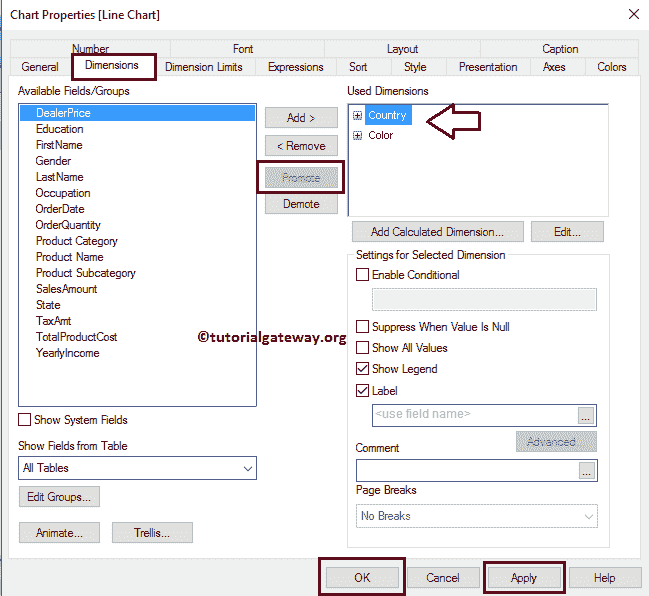

# QlikView 中的折线图

> 原文：<https://www.tutorialgateway.org/line-chart-in-qlikview/>

QlikView 中的折线图便于连接各个点。我们可以使用 QlikView 折线图来查找预测详细信息或销售趋势等。让我们通过例子来看看如何在 QlikView 中创建折线图。对于这个 QlikView 折线图演示，我们将使用下面 Excel 表格中的数据。

从下面的截图可以看到，我们正在将上面指定的 excel 工作表加载到 QlikView 中，并将其用于折线图。

## 在 QlikView 中创建折线图

在这个 QlikView 示例中，我们为数据源中出现的所有产品颜色创建了一个折线图。这可能有助于我们分析哪个有色产品比另一个更有趋势。为此，我们使用颜色列作为维度数据(X 轴)，使用 Y 轴上的销售额表达式。

我们可以用多种方法创建 QlikView 折线图:请导航到布局菜单，选择新建工作表对象，然后选择图表..选项

另一种方法是右键单击报告区域打开上下文菜单。请选择新工作表对象，然后选择图表..选项。

无论哪种方式，它都会打开一个新窗口来创建折线图。从下面的截图中，看到我们分配了一个新的名称，然后选择了折线图作为类型

请选择要在 QlikView 折线图中使用的维度列。在本例中，我们将“颜色”维度添加到“已用维度”部分。这意味着它向 X 轴添加了颜色维度。导入 excel 表格请参考 [QlikView](https://www.tutorialgateway.org/qlikview-tutorial/) 中[将数据从 Excel 导入 QlikView](https://www.tutorialgateway.org/import-data-from-excel-to-qlikview/) 一文。

单击“下一步”按钮会打开“表达式”页面，在此之上，会打开一个名为“编辑表达式”的弹出窗口。使用此窗口为 Y 轴数据编写自定义表达式，或选择列。

这里，我们在表达式 OK 部分下编写一个表达式。如果您不知道如何编写表达式，请选择“作为销售额归档”、“作为总和汇总”，然后单击“粘贴”按钮。

单击确定按钮关闭编辑表达式窗口，然后单击下一步按钮。

在这里，我们可以指定颜色维度的排序顺序。在这个 QlikView 折线图示例中，我们按照升序对颜色进行排序。

下一页是更改折线图的外观和样式。在这里，我们将地块颜色样式更改为灯光渐变。

在这里，更改 QlikView 折线图的显示方式。例如，我们可以更改条形设置，启用滚动轴等。

“颜色”页对于更改折线图的颜色模式很有用。尝试不同的选择！。

接下来，我们将格式化表达式值。众所周知，销售金额的总和就是钱，我们选择的是钱。

使用此页面根据要求更改字体系列、样式和字体大小。从下面的截图，看到我们把字体= Segoe WP 半粗体，字体大小改成了 11

使用此布局页面为 QlikView 折线图提供阴影效果，或通过单击应用主题按钮应用自定义主题。从下面的截图中，可以看到我们将阴影强度更改为“中”，将边框宽度更改为 3(边框的额外厚度)。

标题页是 QlikView 折线图标题的样式。在这里，我们可以更改折线图的背景、位置、颜色等。在这里，我们更改了活动和非活动标题文本的颜色。完成后，点击【完成】按钮

现在，看看我们新创建的折线图。

### 在 QlikView 中创建多个折线图

通过以上一条满足了我们的要求。让我们检查一下每个国家的销售趋势。为此，我们必须将国家维度添加到现有折线图中。为此，右键单击它并从上下文菜单中选择属性选项。

单击属性选项将打开一个名为属性的新窗口。请导航到维度选项卡->将国家/地区添加到已用维度->下一步，使用提升按钮将国家/地区维度移动到顶部位置。

现在，看看每个颜色和国家的销售趋势。

让我们将鼠标悬停在 QlikView 折线图上。请注意，它显示的是国家名称、颜色和销售额(数据标签)。

