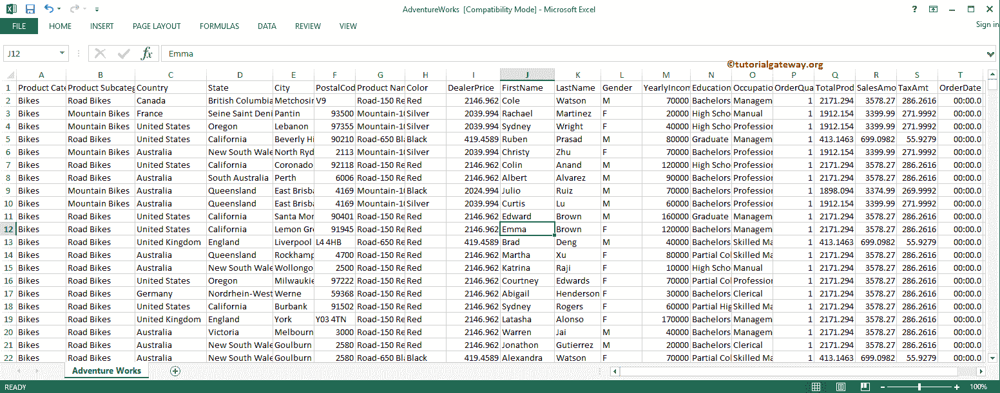
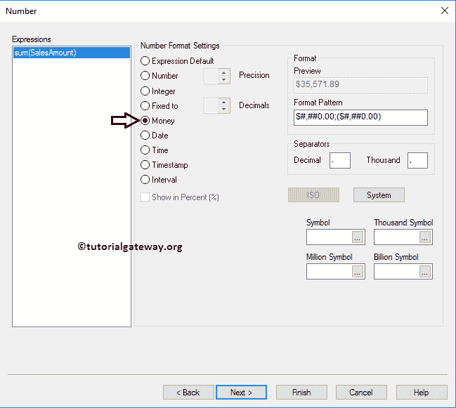

# QlikView 中的 Mekko 图表

> 原文：<https://www.tutorialgateway.org/mekko-chart-in-qlikview/>

QlikView 中的 Mekko 图表对于显示多达三个级别的数据非常有用。在本文中，我们通过一个例子展示了如何在 QlikView 中创建一个 Mekko 图表。对于这个 QlikView Mekko 图表演示，我们将使用下面的 Excel 表格中的数据。

对于这个 QlikView Mekko 图表演示，我们正在将上面指定的 excel 表加载到 QlikView 中。

## 在 QlikView 中创建 Mekko 图表

在这个 QlikView 示例中，我们为所有国家、职业和相应的销售额创建了一个 Mekko 图表。为此，我们将使用国家、职业列作为维度数据，并使用销售额表达式。

我们可以通过多种方式创建 QlikView Mekko 图表。第一种方法:请导航到布局菜单，选择新建工作表对象，然后选择图表..选项

另一种方法是右键单击报告区域打开上下文菜单。请从上下文菜单中选择新工作表对象，然后选择图表..选项。

无论哪种方式，它都会打开一个新窗口，在 QlikView 中创建一个 Mekko 图表。从下面的截图，看到我们给我们的演示分配了一个新的名称，然后选择了类型。在 [QlikView](https://www.tutorialgateway.org/qlikview-tutorial/) 中导入 excel 表格，请参考[将数据从 Excel 导入 QlikView](https://www.tutorialgateway.org/import-data-from-excel-to-qlikview/) 一文。

请选择用于此进程的维度列。在本例中，我们将“国家”和“职业”维度添加到“使用的维度”部分。

单击“下一步”按钮将打开“表达式”页面，在此之上，将打开一个弹出的“编辑表达式”窗口。使用此窗口编写自定义表达式。

从下面的截图中，我们在表达式 OK 部分下写了一个表达式。如果您不知道如何编写表达式，请选择“作为销售金额归档”、“作为总和汇总”，然后单击“粘贴”按钮。

单击确定按钮关闭编辑表达式窗口，然后单击下一步按钮。

排序页用于指定维度的排序顺序。在这个例子中，我们按照升序对国家进行排序。

下一个 QlikView Mekko 图表页面是改变外观和风格。在这里，我们将绘图区域背景样式更改为阴影，将绘图颜色样式更改为灯光渐变。

演示文稿页面会更改其演示文稿。例如，更改数据点、启用轴滚动等。

轴页面可用于更改轴颜色、比例和比例长度(最小值、最大值等)

“QlikView Mekko 图表颜色”页面对于更改颜色模式非常有用。尝试混合不同的选项

格式化表达式值:众所周知，销售金额的总和就是金钱，所以我们选择金钱。

字体页面根据需要更改字体系列、样式和字体大小。在这里，我们将字体= Sitka Small 和字体大小更改为 11

布局页为此提供阴影效果，并通过单击。应用主题按钮。从下面的截图中，可以看到我们将阴影强度更改为“强烈”，将边框宽度更改为 3(边框的额外厚度)。

使用此标题页面设置 QlikView Mekko 图表标题的样式。在这里，您可以更改梅克图表的背景、位置、颜色等。从下面的截图，看到我们改变了活动文本的颜色和背景。完成后，单击“完成”按钮。

现在，在 QlikView 中查看我们新创建的 Mekko 图表。

将鼠标悬停在 Mekko 图表上，显示国家名称、职业和销售额(数据标签)。

