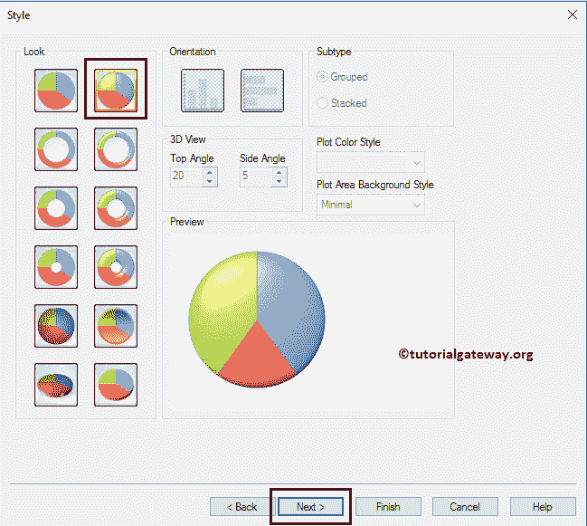

# QlikView 中的饼图

> 原文：<https://www.tutorialgateway.org/pie-chart-in-qlikview/>

QlikView 中的饼图对于显示国家/地区、地区销售等非常有用。让我们通过一个例子来看看如何在 QlikView 中创建饼图。在这个 QlikView 饼图演示中，我们将使用下表中的数据。

从下面的截图中，可以看到我们正在将上面指定的 excel 工作表加载到 QlikView 中。

## 在 QlikView 中创建饼图

在这个 QlikView 饼图示例中，我们找出哪个国家拥有最大的销售份额。为此，我们将使用国家/地区列作为维度数据，使用销售额表达式作为切片大小。

我们可以用多种方法创建 QlikView 饼图:右键单击报告区域打开上下文菜单。请选择新工作表对象，然后选择图表..选项。

第二种方法:请导航到布局菜单，选择新建工作表对象，然后选择图表..选项

无论哪种方式，它都会打开一个新窗口来创建饼图。这里，我们分配了一个新名称，然后选择饼图作为类型

请选择要在 QlikView 饼图中使用的维度列。在本例中，我们将“国家”维度添加到“使用的维度”部分。参见 [QlikView](https://www.tutorialgateway.org/qlikview-tutorial/) 中[将数据从 excel 导入 QlikView](https://www.tutorialgateway.org/import-data-from-excel-to-qlikview/) 一文，了解导入 Excel 表。

单击维度页面上的下一步按钮打开表达式页面。除此之外，一个名为“编辑表达式”的弹出窗口打开了。使用此窗口为 QlikView 饼图数据编写自定义表达式，或选择列。

在这里，我们选择“归档”作为“销售金额”，选择“汇总”作为“总和”。注意，如果你知道怎么写一个表达式，那就写在表达式 OK 部分

下面的空白处

单击确定按钮关闭编辑表达式窗口，然后单击下一步按钮。

在此，指定维度的排序顺序。在本例中，我们按照升序对国家名称进行排序。

下一页是改变外观和风格。在这里，我们可以选择三维或 2D 饼图。

演示页面用于更改 QlikView 饼图设置:

*   弹出标签:将鼠标悬停在饼图上会显示相应的表达式值和维度名称。在本例中，它显示了国家名称和销售额
*   抑制零值:忽略零值
*   隐藏缺失:忽略空值
*   突出显示:将鼠标悬停在饼图切片上向前推一点(我们可以说它突出显示)。
*   显示图例:要不要显示图例？。如果是，勾选该选项；否则，取消选中它。

“颜色”页面对于更改 QlikView 饼图颜色模式非常有用。这里，我们保留默认设置。

接下来，我们将格式化表达式值。它只反映当我们显示数据标签或数据点时。众所周知，销售金额的总和就是金钱，所以我们选择金钱。

请根据要求更改字体系列、样式和字体大小。这里，我们将字体改为卡利布里，字体大小改为 12

标题页使 QlikView 饼图标题风格化。意思是颜色、背景、位置等。完成后，单击“完成”按钮。这里，我们更改了字体颜色。

现在，在 QlikView 中查看我们新创建的饼图。

让我们把鼠标悬停在澳大利亚地区。从下面的截图中，可以看到它被数据标签分割开来。

