# QlikView 中的雷达图

> 原文：<https://www.tutorialgateway.org/radar-chart-in-qlikview/>

QlikView 中的雷达图对于可视化数字数据非常有用。我们可以称 QlikView 雷达图为折线图，其中 X 轴值以 360 度包裹。

在本文中，我们将通过示例展示如何在 QlikView 中创建雷达图。在这个 QlikView 雷达图演示中，我们使用了下表中的数据。

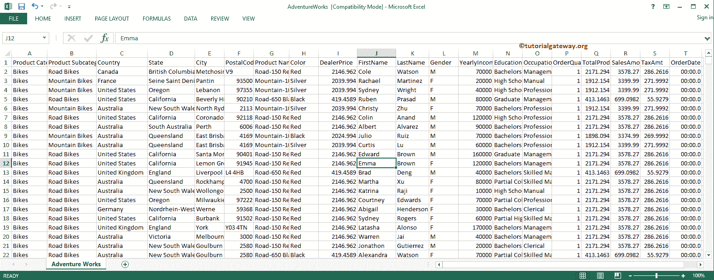

从下面的截图中，可以看到我们正在将上面指定的 excel 表加载到 QlikView 中，并将其用于雷达图。

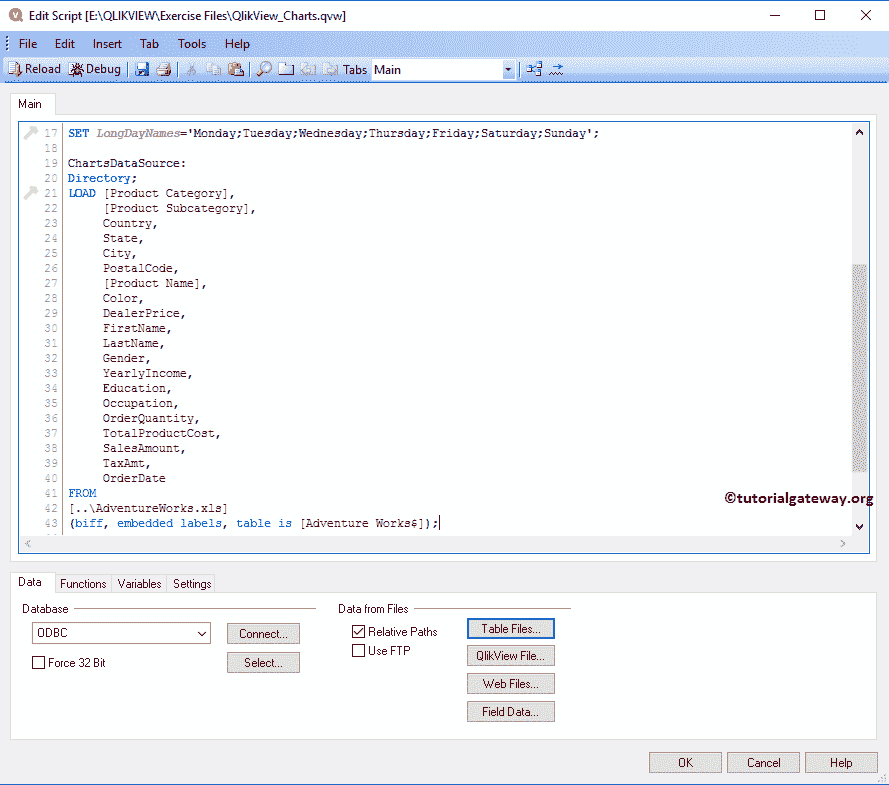

## 在 QlikView 中创建雷达图

在本例中，我们为所有国家创建了一个 QlikView 雷达图，并在数据源中显示了相应的销售额。为此，我们使用国家/地区列作为维度数据和销售额表达式。

我们可以用多种方法创建 QlikView 雷达图:请导航到布局菜单，选择新建工作表对象，然后选择图表..选项

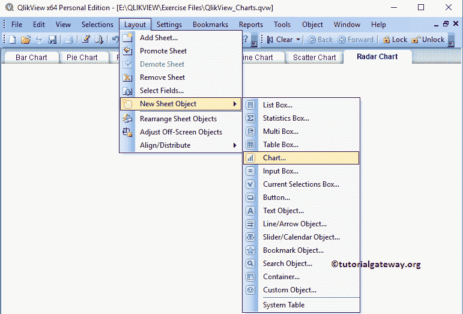

另一种方法是右键单击报告区域。接下来，请从上下文菜单中选择新建工作表对象，然后选择图表..选项。

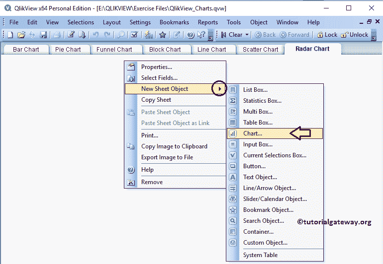

无论哪种方式，它都会打开一个新窗口来创建雷达图。从下面，看到我们给我们的图表分配了一个新的名字叫做雷达图示例，然后选择了图表类型作为雷达图

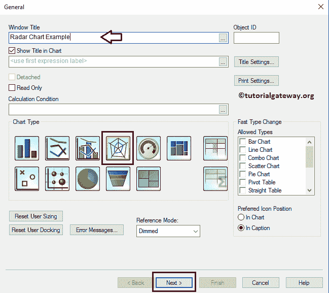

请选择要在雷达图中使用的维度列。对于这个 QlikView 雷达图示例，我们正在将国家维度添加到已用维度部分。这意味着所有的国家名称都以 360 度角显示。参考[将数据从 excel 导入到 QlikView](https://www.tutorialgateway.org/import-data-from-excel-to-qlikview/) 一文，了解将 Excel 表导入到 [QlikView](https://www.tutorialgateway.org/qlikview-tutorial/) 中。

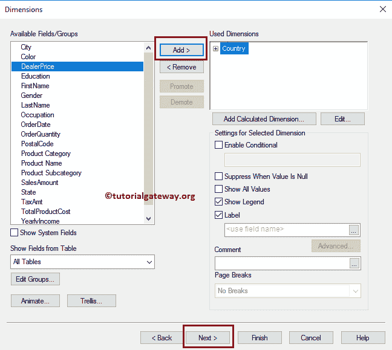

单击下一步按钮打开雷达图表达式页面。除此之外，一个弹出的编辑表达式窗口打开了。使用此窗口编写自定义表达式或选择列。

从下面可以看到，我们正在表达式确定部分下编写一个表达式。如果您不知道如何编写表达式，请选择“字段”作为“销售额”，选择“合计”作为“总和”，然后单击“粘贴”按钮。

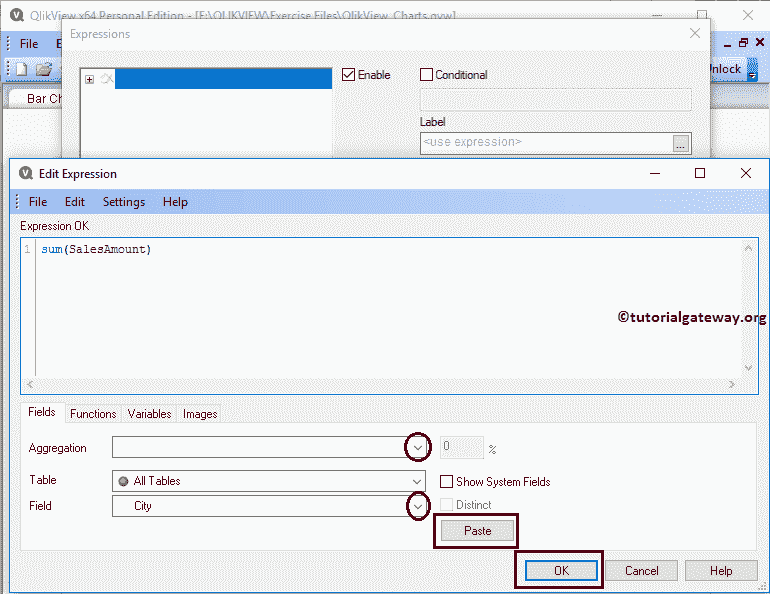

单击确定按钮关闭编辑表达式窗口，然后单击下一步按钮。

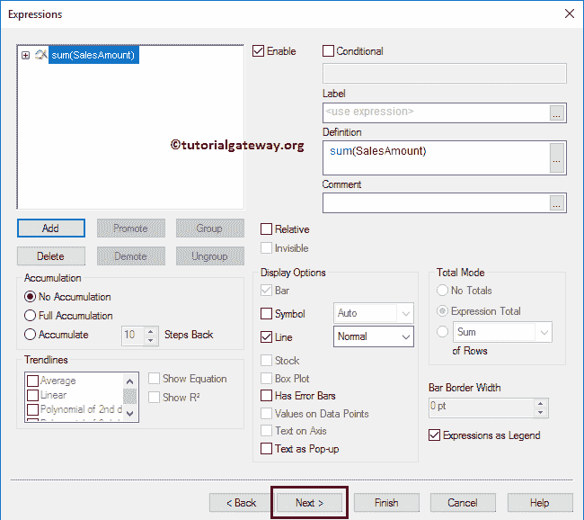

“雷达图排序”页面可用于指定国家/地区维度的排序顺序。在这个例子中，我们按照升序对国家进行排序。

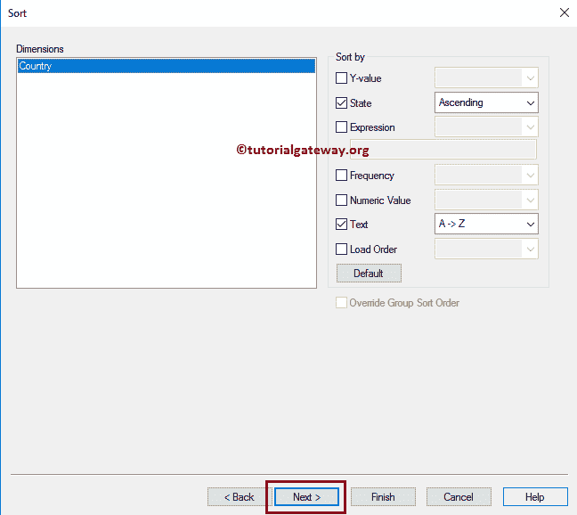

下一页改变了雷达图的外观和风格。在这里，我们将地块颜色样式更改为灯光渐变。

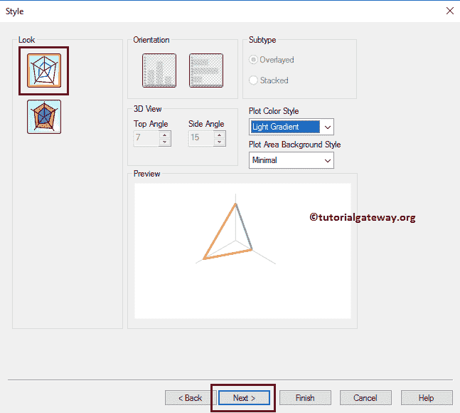

QlikView 雷达图演示页面更改了演示。例如，我们可以更改条形设置，启用滚动轴等。

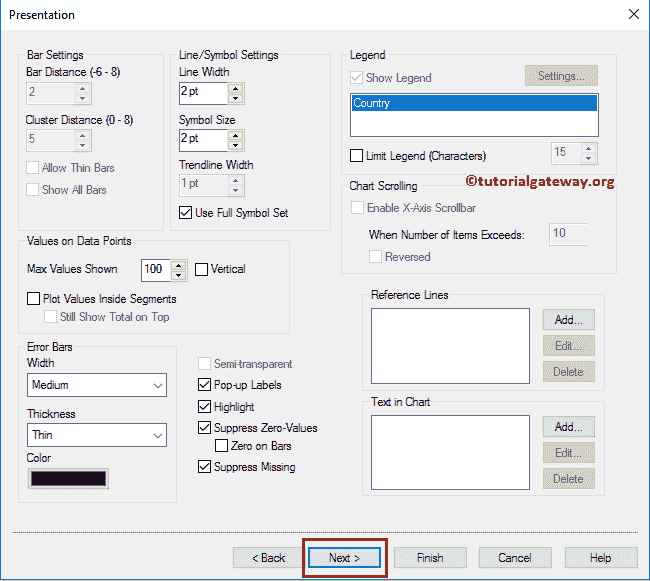

轴页面可用于更改轴颜色、比例，我们可以更改比例长度(最小值、最大值等)

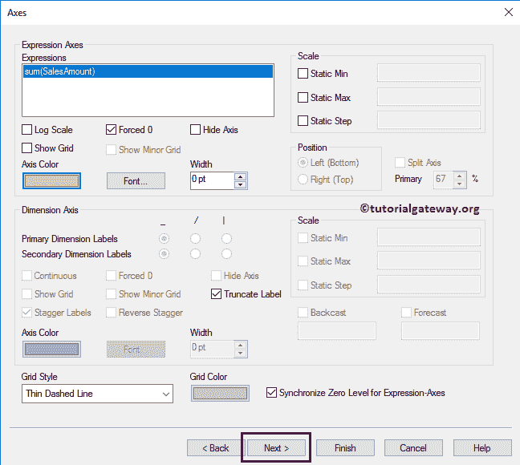

QlikView 颜色页面可用于更改雷达图的颜色模式。尝试混合不同的选项。

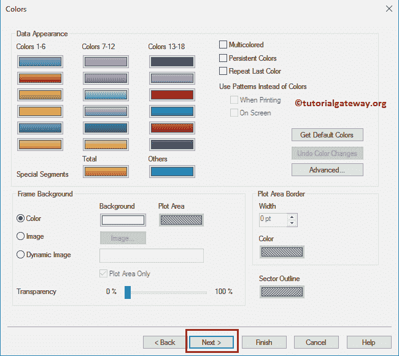

接下来，我们将格式化表达式值。众所周知，销售金额的总和就是钱，所以我们选择的是钱。

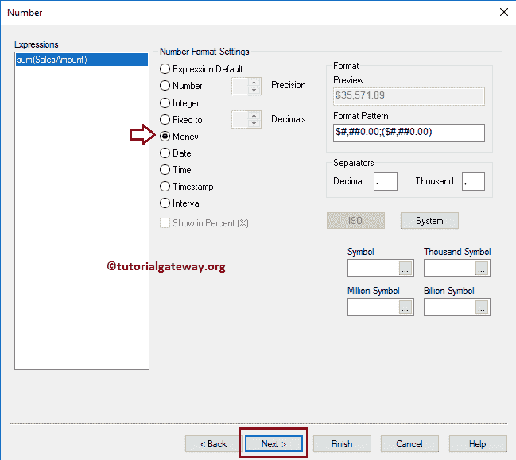

“雷达图字体”页面根据要求更改字体系列、样式和字体大小。从下面的截图中，我们看到字体=罗克韦尔，字体大小改为 11。

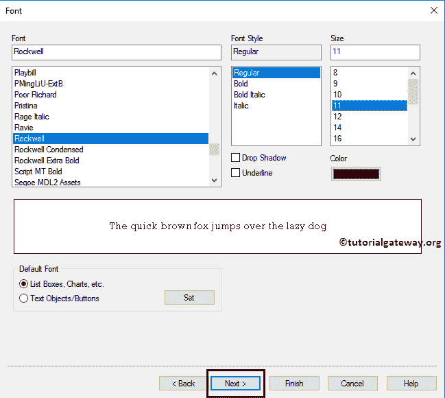

布局页面为雷达图提供阴影效果，或者通过单击应用主题按钮应用自定义主题。从下面的截图中，可以看到我们将阴影强度更改为“中”，将边框宽度更改为 3(边框的额外厚度)。

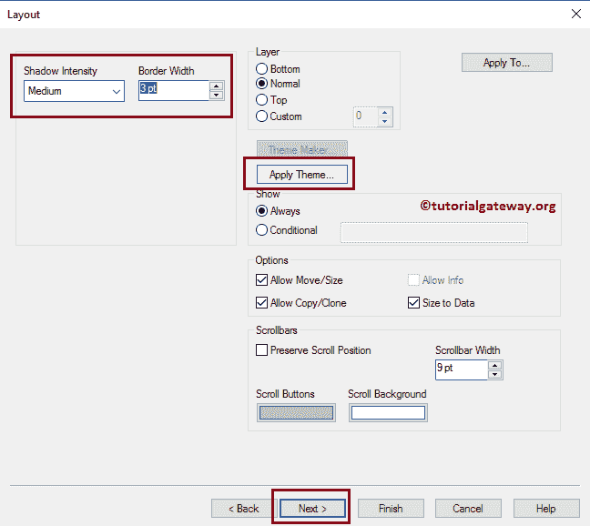

使用此标题页面设置 QlikView 雷达图标题的样式。在这里，我们可以更改雷达图的背景、位置、颜色等。从下面，我们更改了活动文本的颜色。完成后，单击“完成”按钮。

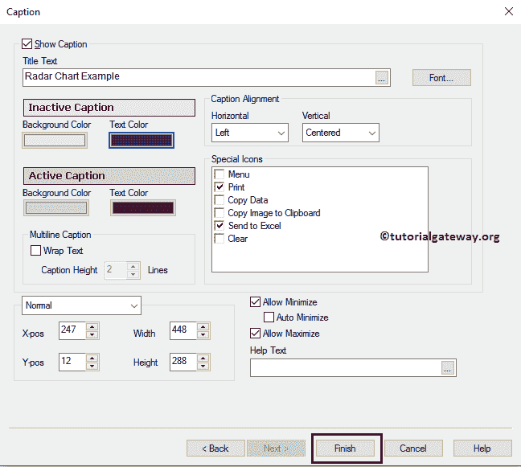

现在，在 QlikView 中查看我们新创建的雷达图。

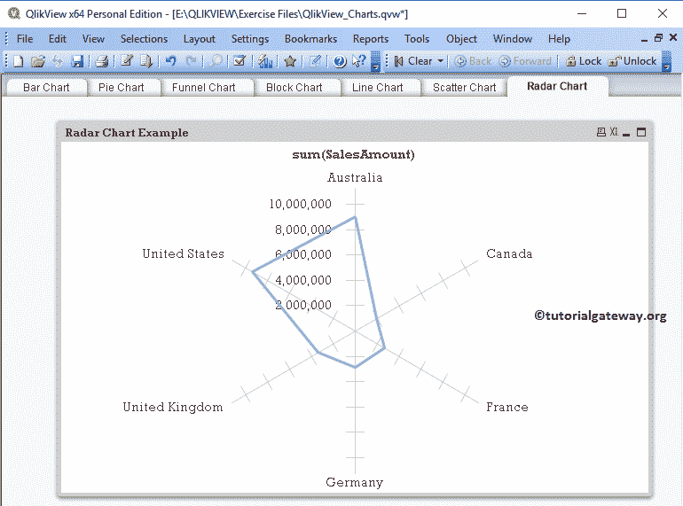

通过上面的图表满足了我们的要求。让我们增加一个维度来显示每个颜色和国家的雷达图。为此，我们必须向现有的雷达图添加颜色维度。为此，右键单击图表并从上下文菜单中选择属性选项。

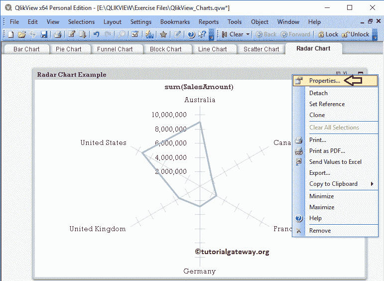

单击属性选项将打开一个名为图表属性[雷达图示例]的新窗口。请导航到维度选项卡，并将颜色添加到已用维度。

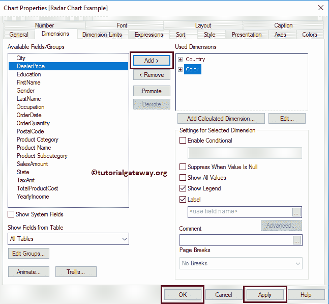

现在，查看 QlikView 雷达图中每个颜色和国家

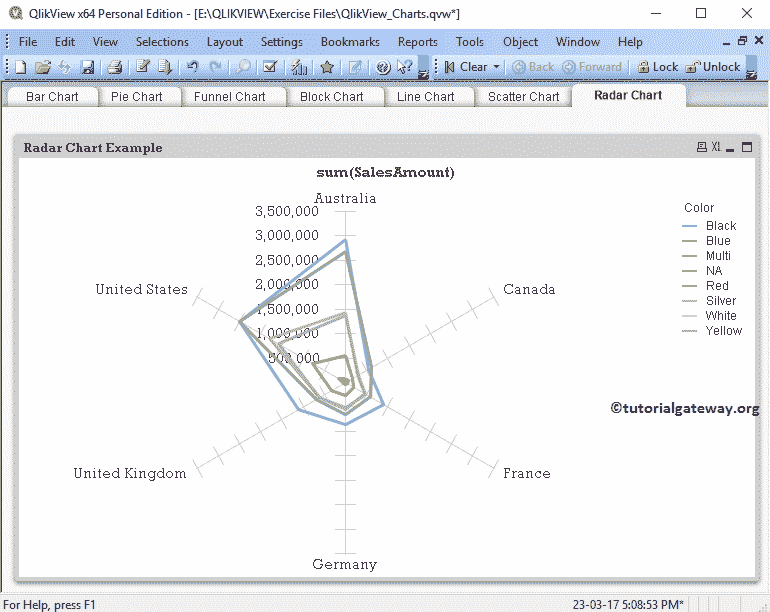

请参考 [QlikView 折线图](https://www.tutorialgateway.org/line-chart-in-qlikview/)文章。