# QlikView 中的散点图

> 原文：<https://www.tutorialgateway.org/scatter-chart-in-qlikview/>

QlikView 中的散点图对于直观地比较两组数据非常有用。在本文中，我们将通过示例向您展示如何在 QlikView 中创建散点图。在这个散点图示例中，我们使用了下表中的数据。

对于这个 QlikView 散点图，我们将上面指定的 excel 表加载到 QlikView 中。

## 在 QlikView 中创建散点图

我们可以用多种方法创建 QlikView 散点图:请导航到布局菜单，选择新建工作表对象，然后选择图表..选项

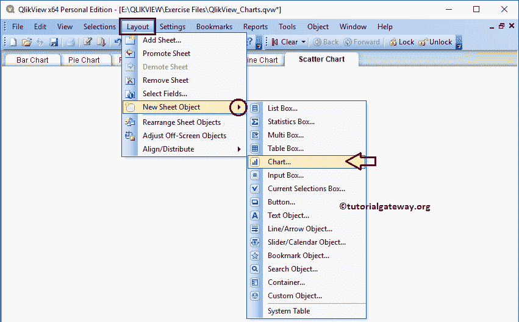

另一种方法是右键单击报告区域将打开上下文菜单。因此，请从上下文菜单中选择新建工作表对象，然后选择图表..选项。

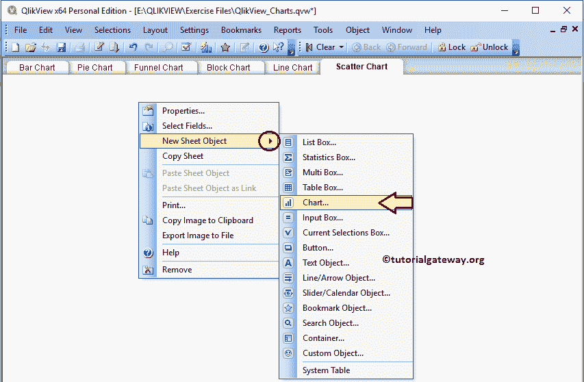

无论哪种方式，它都会打开一个新窗口来创建散点图。从下面的截图可以看到，我们给我们的图表分配了一个新的名字叫做散点图示例，然后选择散点图作为图表类型

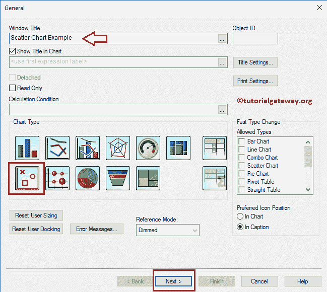

请选择要在 QlikView 散点图中使用的维度列。在本例中，我们将邮政编码维度添加到已用维度部分。建议大家参考 [QlikView](https://www.tutorialgateway.org/qlikview-tutorial/) 中[从 excel 导入数据到 QlikView](https://www.tutorialgateway.org/import-data-from-excel-to-qlikview/) 一文，了解导入 Excel 表涉及的步骤。

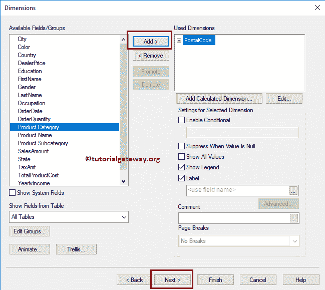

单击“下一步”按钮后，将打开“表达式”页面。从下面的截图中可以看到，我们选择了与 X 轴字段相同的金额，以及 Y 轴中的订单数量。这意味着，我们将比较这两个度量值。通过选中高级模式选项，您可以执行更高级的操作。

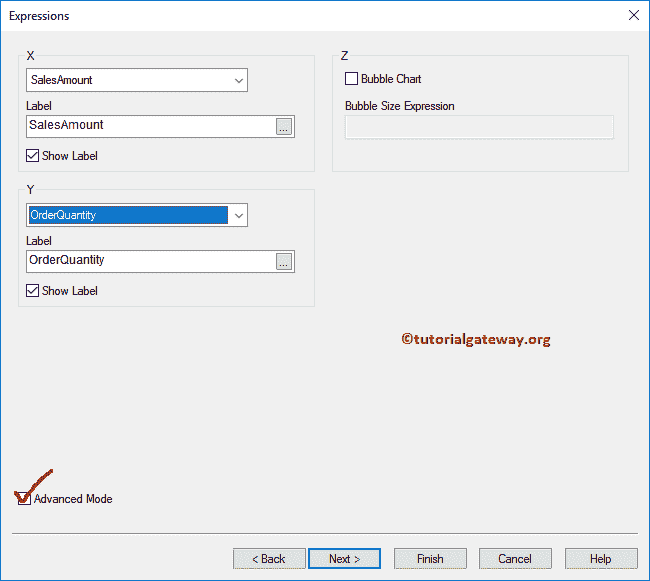

选中高级模式选项后，将打开以下页面。在这里，您可以编写自定义表达式。单击下一步按钮。

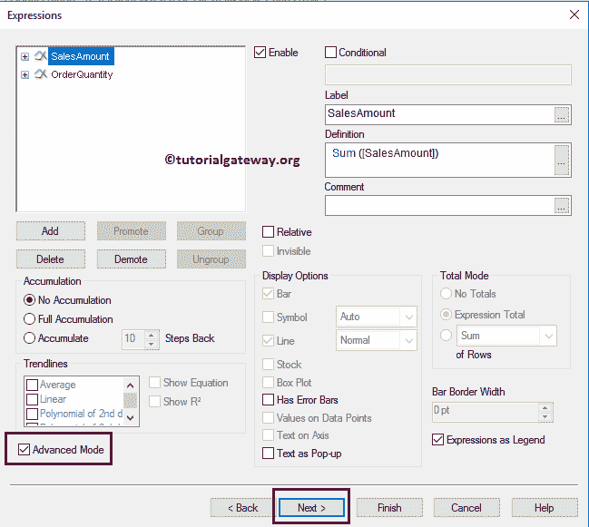

排序页对于指定邮政编码维度的排序顺序很有用。在这个 QlikView 散点图示例中，您可以按升序或降序对邮政编码进行排序。

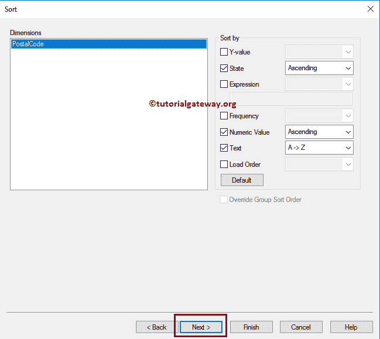

样式页用于更改散点图的外观和样式。

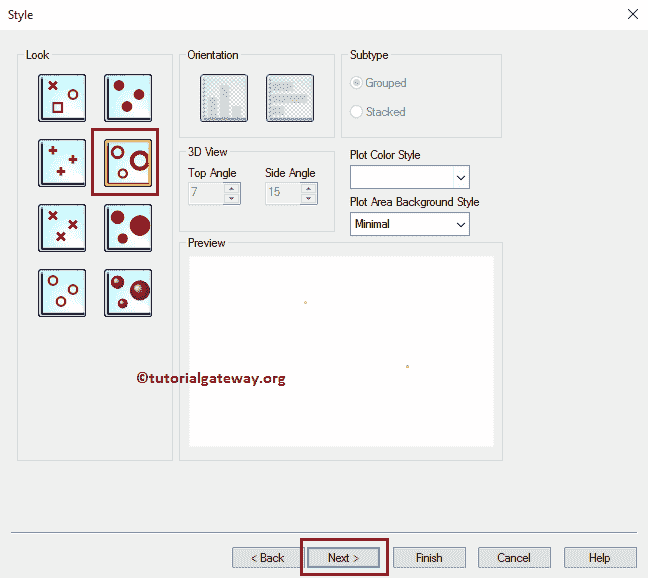

在这里，您可以更改散点图的显示方式。目前，我们将符号大小更改为 4pt。这将增加分散符号的大小。

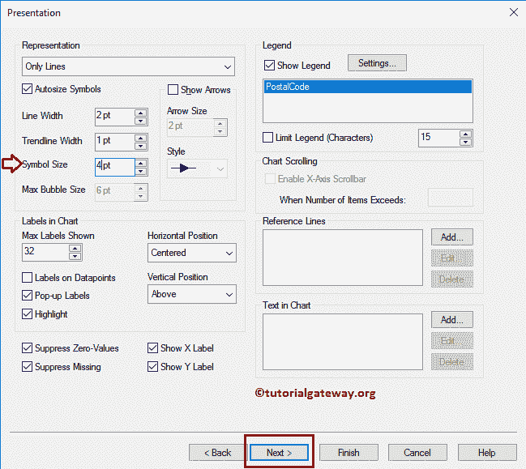

轴页面将帮助您改变 QlikView 散点图的 X 轴和 Y 轴属性。

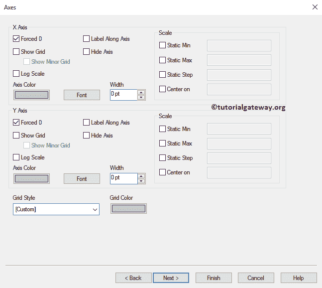

您可以使用“颜色”页面来更改散点图的颜色模式。尝试不同的选项

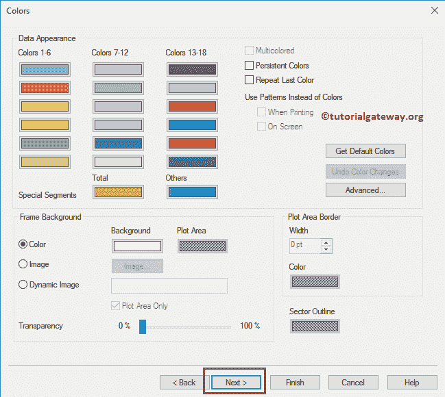

接下来，我们将格式化表达式值。众所周知，订单数量是数字，所以我们选择数字。销售总额就是钱，这就是我们选择钱的原因。

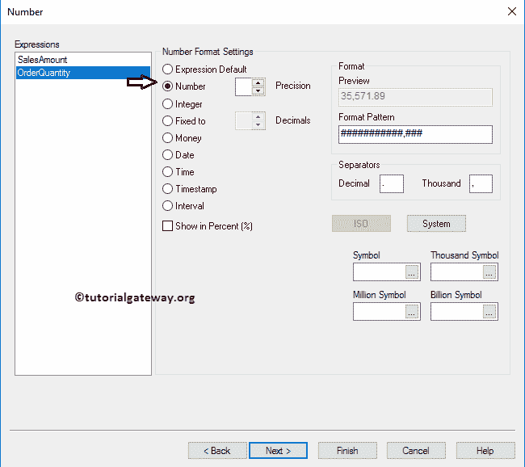

使用此 QlikView 散点图页面根据您的要求更改字体系列、样式和字体大小。从下面的截图可以看到，我们把字体=古英语文字 MT，字体大小改为 11

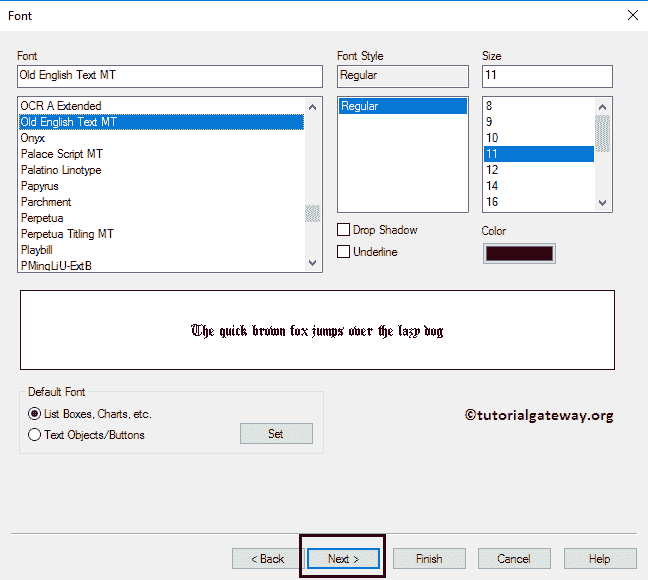

布局页面用于为散点图提供阴影效果，或者您可以通过单击应用主题按钮来应用自定义主题。这里，我们将阴影强度更改为“中”，将边框宽度更改为 3(边框的额外厚度)。

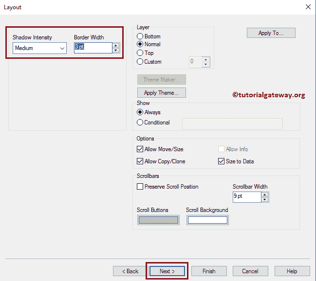

标题页用于设置 QlikView 散点图标题的样式。在这里，您可以更改散点图的背景、颜色、位置等。现在，我们更改了非活动标题文本颜色和背景颜色。完成后，点击【完成】按钮

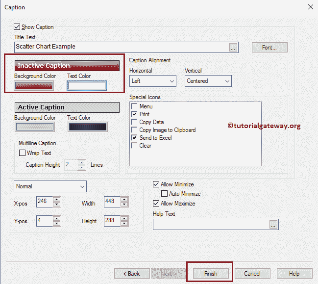

现在，您可以在 QlikView 中看到我们新创建的散点图。

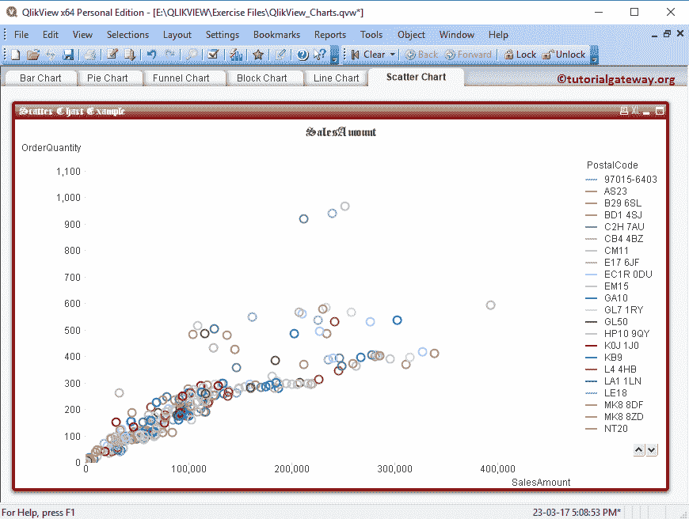

让我将鼠标悬停在符号上。如您所见，它显示邮政编码、销售额和订单数量(数据标签)。

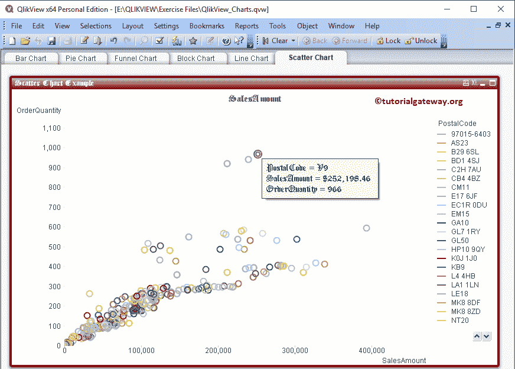